on policy指的是每次从0开始训练，action直接作用于当前环境，学习的数据分布就是当前环境的数据分布，优点是无偏的、效果优良，缺点是训练慢、消耗大、收敛困难。典型算法有SARSA（State-Action-Reward-State-Action）, PPO（Proximal Policy Optimization）。

off policy指的是有一个replay buffer（经验回放池），存储了别人在相同场景（不是一个环境，但是一个任务）下的（s，a，r）trace，从这些历史数据中学习，交互是在本环境交互。优点是有偏的（因为不是一个环境，学习的分布是别人的，拟合的分布是自己的），优点是训练快，消耗小。典型算法有Q-Learning（Q-value Learning）, DQN（Deep Q-Network）, SAC（Soft Actor-Critic）。
- 这里的Q指的是Quality，代表某质量-动作对的价值

这两个公式的核心目标都是为了更新一个叫做 **Q-value** 的东西。你可以把 Q-value `Q(s, a)` 想象成一个“**决策参考表**”或“**作弊小抄**”。它告诉智能体（Agent），在某个状态 `s` 下，执行某个动作 `a` 预计能带来的长期总回报有多高。分数越高，说明这个选择越好。

### 关键逻辑组件

在看公式之前，我们先统一几个“零件”的含义：

* `s`: 当前的状态 (state)
* `a`: 在当前状态下执行的动作 (action)
* `r`: 执行动作后立即获得的奖励 (reward)
* `s'`: 执行动作后进入的下一个状态 (next state)
* `a'`: 在下一个状态 `s'` 执行的下一个动作 (next action)
* `α` (alpha): **学习率 (Learning Rate)**。你可以理解为“本次学习的认真程度”，或者说“有多大程度上相信这次的新经验”。值在0到1之间。
* `γ` (gamma): **折扣因子 (Discount Factor)**。你可以理解为“对未来的重视程度”或“远见”。值在0到1之间，越接近1说明越有远见，越看重未来的长期奖励。

---

### On-Policy (在策略) 的典型公式：SARSA

SARSA 这个名字本身就是公式的“零件”清单：**S**tate, **A**ction, **R**eward, **S**tate', **A**ction'。它非常老实，完全按照自己实际的经历来学习。

**公式：**
$$Q(s, a) \leftarrow Q(s, a) + \alpha \cdot [r + \gamma \cdot Q(s', a') - Q(s, a)]$$

**通俗解读：**

这个公式看起来复杂，我们把它翻译成大白话：

`更新后的Q值 ← 当前的Q值 + 学习率 × ( 新的现实估计 - 旧的预期 )`

* **`Q(s, a)`** 是我们对“在`s`状态做`a`动作”的**旧的预期**。
* **`r + γ ⋅ Q(s', a')`** 是我们根据刚发生的一步经历得出的**新的、更真实的现实估计**。

我们来重点看这个“新的现实估计”是怎么来的：

**`r + γ ⋅ Q(s', a')`** 可以翻译为：“**这次马上得到的奖励 `r`**，加上 **对未来的期望**”。

这里的关键，也是体现 On-Policy 精神的地方，就在于 `Q(s', a')`。这里的 `a'` 是智能体**遵循它当前的策略**，在进入新状态 `s'` 后，**实际要做的下一个动作**。

Q(state-action) = Q(state-action) + a(r + y * Q(state'-action') - Q(state-action))
state + action -> state'
action' decided by policy'
- action'是根据当前策略在state'下做出的最佳的动作
- 更新后的Q（对这个state-action预测的更准确了），是怎么更新的：是从当下的估计值加上一个偏值，为什么就变准确了：看的更远了，相当于多看了一步，确定性增强，自然就更准了
>[!note]
>这里的action并不是都是基于当前state的最优Q来产生的，因为这样就纯exploitation了，他其实会有一个拒绝率，比如0.1，就代表他会有0.1的概率拒绝当下的最优action，而是随机选一个action执行，直接和任务世界交互，这就有了exploration

---

### Off-Policy (离策略) 的典型公式：Q-Learning

Q-Learning 不关心实际是怎么做的，它只关心什么是最好的。

**公式：**
$$Q(s, a) \leftarrow Q(s, a) + \alpha \cdot [r + \gamma \cdot \max_{a'} Q(s', a') - Q(s, a)]$$

**通俗解读：**

公式结构和SARSA几乎一模一样，唯一的、也是最核心的区别在于对“未来期望”的计算。

**`r + γ ⋅ max_{a'} Q(s', a')`** 可以翻译为：“**这次马上得到的奖励 `r`**，加上 **对未来最乐观的期望**”。

这里的关键是 **`max_{a'} Q(s', a')`**。它的意思是：
在新状态 `s'`，**不管我下一步实际上会怎么走**，我都先“环顾四周”，评估一下所有可能的下一步动作 `a'` 的Q值，然后从中**选出那个分数最高（max）的**，用这个最乐观、最理想的Q值来代表未来的期望。

Q-Learning 总是用理论上的最优选择来指导当前的学习，而不管实际探索的路径有多么曲折。

> [!note]
> off policy并不是只有exploitation，没有exploration，而是他把二者分开了，决策者用于优化Q函数，每次都是选择最大价值的Q来输出action。但是这个action并不会作用到真实世界中，与真实世界（学习经验的世界不是最终任务的世界）交互的是一个探索者，他按照一定的策略进行探索，比如有概率探索，有概率选择最优，理论上可以是任何策略，他的目的是构造（s，a，r，s'）四元组序列供决策者学习

---

#### 核心定义：两个关键的策略

在Off-Policy学习中，我们明确区分两个策略：

1.  **行动策略 (Behavior Policy) `μ`**
    * **角色**：“胆大的试车手”或“行动者”。
    * **任务**：负责与环境进行实际交互，收集经验数据。
    * **特点**：必须具有**探索性**，以确保能收集到多种多样的经验。最常用的就是我们之前讨论的 **ε-greedy策略**。

2.  **目标策略 (Target Policy) `π`**
    * **角色**：冷静的“工程师”或“学习者”。
    * **任务**：我们想要学习和优化的最终策略。
    * **特点**：通常是**确定性的、贪婪的**。它的目标是在任何状态下都选择能带来最大Q值的动作，即 `π(s) = argmax_a Q(s, a)`。它本身不进行探索。

---

#### 1. 交互方法：经验回放 (Experience Replay)
这是Off-Policy算法收集和利用数据的核心机制。它通过一个叫做“经验回放池”（Replay Buffer）的组件，将“行动”和“学习”在时间上解耦。

**交互流程如下：**

**第一步：初始化**
* 初始化一个Q网络（我们的“小抄”），参数为 `θ`。
* 初始化一个容量有限的“**经验回放池**” `D`。这个池子就像一个大仓库，用来存放经验。

**第二步：循环交互与学习**
这个过程会一直重复：

1.  **进行探索 (由行动策略 `μ` 负责)**
    * 在当前状态 `s`，使用**行动策略 `μ`** (例如 ε-greedy) 来选择一个动作 `a`。
    * `a = μ(s)`

2.  **执行并观察**
    * 在环境中执行动作 `a`。
    * 观察得到的奖励 `r` 和进入的下一个新状态 `s'`。

3.  **存储经验**
    * 将这次的经历，即一个四元组 `(s, a, r, s')`，作为一个数据点存入经验回放池 `D` 中。
    * 如果 `D` 满了，通常会移除最旧的一条经验。

4.  **进行学习 (由目标策略 `π` 体现)**
    * **从经验池中随机采样**：从 `D` 中随机抽取一小批（a mini-batch）过去的经验，例如 `N` 条， `(s_j, a_j, r_j, s'_j)`。
    * **利用这些采样出的数据进行学习**：使用下面的学习公式来更新Q网络。

**这个方法的巧妙之处在于：**
* **数据复用**：一次宝贵的交互经验可以被反复采样和学习，极大地提高了数据效率。
* **打破相关性**：通过随机采样，打乱了经验之间的时间顺序，使得训练过程更稳定（类似于监督学习中打乱数据集）。**符合周期性的要求** 
* **实现Off-Policy**：经验池 `D` 中的数据是由过去的各种版本的行动策略 `μ` 收集的，而学习过程则是为了优化我们当前的目标策略 `π`。

---

#### 2. 学习更新公式 (Q-Learning)
当从经验回放池中采样出一批数据后，我们就用下面的公式来更新我们的Q网络。

对于采样出的每一条经验 $(s_j, a_j, r_j, s'_j)$：

**第一步：计算“目标Q值” (Target Q-value)**
这个“目标Q值” $y_j$ 就是我们认为 $Q(s_j, a_j)$ 应该努力靠近的“正确答案”。它的计算体现了**目标策略 `π`** 的思想：
$$y_j = r_j + \gamma \cdot \max_{a'} Q(s'_j, a')$$

* $r_j$：我们立即获得的奖励，这是确定无疑的。
* $γ \cdot max_{a'} Q(s'_j, a')$：这是对未来价值的**最优化估计**。这里的 `max` 操作，正是在模拟我们的**目标策略 `π`**（那个贪婪的策略）会在新状态 $s'_j$ 做出什么样的选择。它完全不关心当时**行动策略 `μ`** 在 $s'_j$ 之后实际做了什么。

**第二步：计算损失 (Loss)**
损失就是我们当前的预测 $Q(s_j, a_j)$ 和“正确答案” $y_j$ 之间的差距，通常使用均方误差（MSE）：
$$Loss = (y_j - Q(s_j, a_j))^2$$

**第三步：更新网络**
使用梯度下降等优化算法，调整Q网络的参数 `θ`，使得这个损失 `Loss` 最小化。

当然知道。这是一个非常好的问题，因为这两个术语长得很像，非常容易混淆，但它们的区别是理解现代强化学习的关键。

简单来说：
**所有的离线强化学习（Offline RL）都属于离策略强化学习（Off-Policy RL），但离策略强化学习（Off-Policy RL）不全是离线（Offline）的。**

Off-Policy RL 是一个更**广泛**的概念（一种学习**方法**），而 Offline RL 是这个概念下的一个**特例**（一个问题**设定**）。

让我们用之前那个厨师的例子来彻底讲清楚。

---
# Online & Offline RL
### Off-Policy RL (离策略强化学习)：一种学习“方法”

这就像我们之前讨论的，核心思想是“学习者”和“行动者”可以分离。

**比喻：**
一位大厨（学习者）想要创造出完美的食谱（目标策略`π`）。他雇了一个学徒（行动者/行动策略`μ`），并对他说：
“你现在就去厨房，**不断地做菜**，可以随便尝试，把每次做菜的过程和顾客的反应都记在笔记本（经验回放池）里。”

在这个场景中：
* **学徒在持续不断地产生新的经验**。厨房是开着火的，菜是正在炒的。
* 大厨**可以随时翻看**学徒的笔记本，包括几分钟前刚写下的新经验。
* 如果大厨发现学徒的探索不够，他可以告诉学徒：“多试试加点辣。” 来指导数据收集的方向。

这里的关键是：**学习过程和数据收集过程是同时进行的，智能体仍然在与环境进行实时交互**。我们称之为**在线学习（Online Learning）**。DQN就是一个典型的在线的、Off-Policy的算法。

---

### Offline RL (离线强化学习)：一个问题“设定”

这是 Off-Policy 思想的一个更极端、更具挑战性的应用场景。

**比喻：**
一位历史学家（学习者）得到了一堆**古代的食谱手稿**（固定的、离线的数据集）。这些手稿是几百年前由很多不同的厨师（未知的行动策略）写下的。
历史学家的任务是，**仅通过研究这些已经存在的手稿**，推断出那道已经失传的“传说中的菜肴”的最佳做法（目标策略`π`）。

在这个场景中：
* **数据是完全固定的、历史的**。没有任何新菜被做出来。厨房是关闭的，历史学家不能要求任何人再炒个菜试试。
* 历史学家**完全无法与环境（古代的厨房和食客）进行任何交互**。
* **数据的质量良莠不齐**。手稿里可能有很多糟糕的菜谱，只有少数是好的。

这里的关键是：**学习过程完全与环境交互分离。我们只有一个静态的数据集，必须在不收集任何新数据的情况下完成学习。**

---

### 核心区别总结

| 特征 | Off-Policy RL (通用) | Offline RL (特例) |
| :--- | :--- | :--- |
| **本质** | 一种**学习方法**：允许学习策略和行动策略不同。 | 一个**问题设定**：数据源是固定的，无额外交互。 |
| **与环境交互** | **是**，学习过程中，行动策略在**持续交互**以收集新数据。 | **否**，学习过程中**完全没有**与环境的交互。 |
| **数据来源** | **动态的**经验回放池，数据在不断更新和增加。 | **静态的**、历史的、有限的数据集，一次性给定。 |
| **核心挑战** | 学习稳定性、探索效率。 | **分布偏移 (Distributional Shift)**：如何确保学到的策略不会在数据集中没见过的区域做出离谱的决策。 |
| **关系** | **父集 (Superset)** | **子集 (Subset)** |

**一句话总结：**

* **Off-Policy** 回答的是“**如何学习？**” —— 我们可以通过观察他人（或过去的自己）来学习一个更好的策略。
* **Offline** 回答的是“**用什么学习？**” —— 我们**只能**用一个给定的、无法更改的历史数据集来学习。

所以，当你使用一个固定的数据集来训练一个强化学习模型时，你就是在做一个 **Offline RL** 的问题，而你用来解决这个问题的算法，必然是一种 **Off-Policy** 的算法。

---

# 强化学习算法分类

强化学习算法可以按照多种维度进行分类，每种分类方式都有其独特的视角和应用场景。下面用思维导图的形式展示主要分类逻辑：

```mermaid
graph TD
    A[强化学习算法分类] --> B[基于环境模型]
    A --> C[基于学习策略]
    A --> D[基于优化对象]
    A --> E[基于数据来源]
    A --> F[基于动作空间]
    A --> G[基于代理数量]

    B --> B1[Model-Free 无模型]
    B --> B2[Model-Based 基于模型]

    B1 --> B11[Value-Based]
    B1 --> B12[Policy-Based]
    B1 --> B13[Actor-Critic]

    B11 --> B111[On-Policy: SARSA]
    B11 --> B112[Off-Policy: Q-Learning, DQN, DDQN, CQL]

    B12 --> B121[On-Policy: REINFORCE, PPO, TRPO]
    B12 --> B122[Off-Policy: 较少]

    B13 --> B131[On-Policy: A3C, A2C]
    B13 --> B132[Off-Policy: DDPG, TD3, SAC]

    B2 --> B21[Dyna-Q]
    B2 --> B22[MBPO]
    B2 --> B23[PETS]

    C --> C1[On-Policy 在策略]
    C --> C2[Off-Policy 离策略]

    C1 --> C11[SARSA, PPO, TRPO, REINFORCE]
    C2 --> C21[Q-Learning, DQN, SAC, TD3, CQL]

    D --> D1[Value-Based 价值]
    D --> D2[Policy-Based 策略]
    D --> D3[Actor-Critic 演员-评论家]

    D1 --> D11[Q-Learning, SARSA, DQN系列]
    D2 --> D21[REINFORCE, PPO, TRPO]
    D3 --> D31[A3C, A2C, SAC, TD3, DDPG]

    E --> E1[Online RL 在线]
    E --> E2[Offline RL 离线]

    E1 --> E11[DQN, PPO, SAC]
    E2 --> E21[CQL, TD3+BC, IQL, AWAC]

    F --> F1[Discrete 离散动作]
    F --> F2[Continuous 连续动作]

    F1 --> F11[Q-Learning, DQN]
    F2 --> F21[PPO, SAC, DDPG]

    G --> G1[Single-Agent 单代理]
    G --> G2[Multi-Agent 多代理]

    G1 --> G11[大多数经典算法]
    G2 --> G21[MADDPG, QMIX, MAPPO]

    A --> H[其他范式]
    H --> H1[表格方法: SARSA, Q-Learning]
    H --> H2[函数逼近: DQN, PPO]
    H --> H3[分层RL: FeUdal Networks, HIRO]
    H --> H4[逆RL: IRL]
```

**说明**：
- 这种分类不是互斥的，一个算法可能同时属于多个类别。
- 例如，PPO既是On-policy，也是Policy-based和Actor-Critic算法。
- 图表中列出了代表性算法，实际应用中还有更多变体和扩展。
