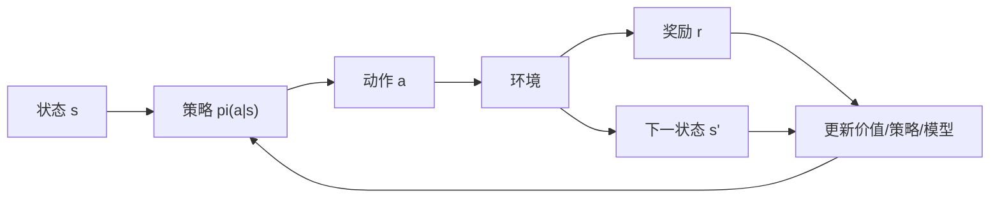
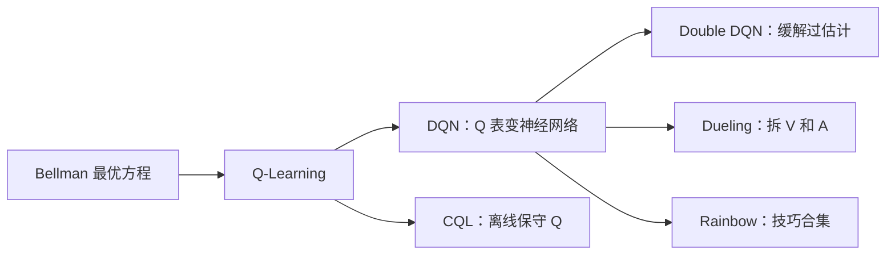
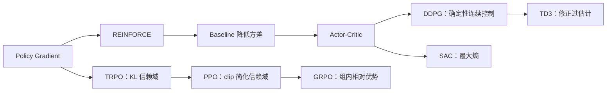
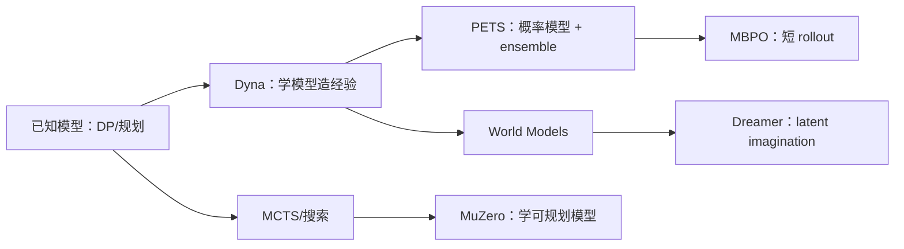
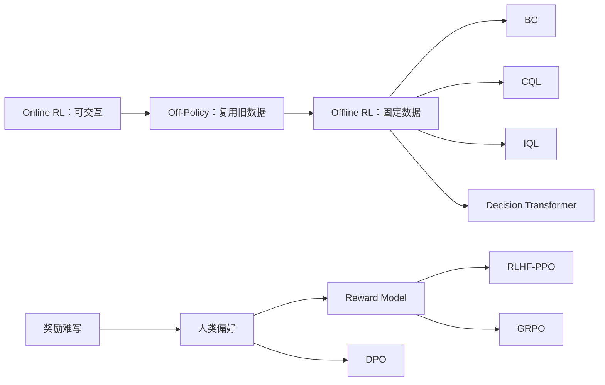
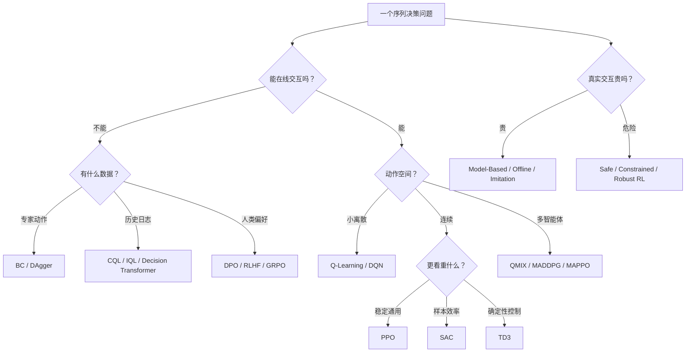

---
tags:
  - reinforcement-learning
  - review
  - knowledge-map
aliases:
  - RL统一复习地图
  - 强化学习总入口
created: 2026-05-15
---

# 强化学习统一复习地图

这份文档是 RL 复习的唯一主入口。目标是用最少结构回答五件事：

1. RL 到底在学什么？
2. 方法分支为什么这么多？
3. 每类方法适合什么场景？
4. 重要算法之间如何演化？
5. 最少要掌握哪些公式？

---

## 1. 一句话总览

强化学习研究的是：

> 智能体在环境中通过试错学习策略，使长期累计回报最大。

核心循环：

总目标：

$$
J(\pi)=\mathbb{E}_\pi\left[\sum_{t=0}^{\infty}\gamma^t r_t\right]
$$

---

## 2. RL 方法为什么会分叉

RL 方法多，不是因为名字多，而是因为问题约束不同。

| 分叉问题 | 产生的分支 | 典型方法 |
|---|---|---|
| 学价值还是直接学策略？ | Value-Based / Policy-Based / Actor-Critic | Q-Learning、DQN、PPO、SAC |
| 是否知道环境模型？ | Model-Free / Model-Based | DQN、PPO、Dyna、MBPO、Dreamer |
| 能不能在线交互？ | Online / Offline RL | PPO、SAC、CQL、IQL、Decision Transformer |
| 动作是离散还是连续？ | 离散控制 / 连续控制 | DQN、PPO、TD3、SAC |
| 奖励好不好写？ | 经典 RL / 模仿学习 / RLHF | BC、IRL、GAIL、DPO、GRPO |
| 是否有多个智能体？ | Single-Agent / Multi-Agent | VDN、QMIX、MADDPG、MAPPO |
| 是否有安全约束？ | Safe / Robust / Risk-Sensitive RL | Constrained RL、CVaR、Robust MDP |

记忆句：

> RL 的算法分支，本质上是在不同约束下解决“如何估计长期价值、如何改进策略、如何安全有效地获取数据”。

---

## 3. 总分类地图

```mermaid
graph TD
    RL["Reinforcement Learning"]

    RL --> Foundation["基础：MDP + Bellman"]
    Foundation --> MC["MC：完整回报"]
    Foundation --> TD["TD：一步自举"]
    Foundation --> DP["DP：已知模型规划"]

    RL --> Value["Value-Based：学 Q"]
    Value --> SARSA["SARSA"]
    Value --> QL["Q-Learning"]
    Value --> DQN["DQN / Double / Dueling / Rainbow"]
    Value --> CQL["CQL：Offline 保守 Q"]

    RL --> Policy["Policy-Based：直接学 pi"]
    Policy --> REINFORCE["REINFORCE"]
    Policy --> TRPO["TRPO"]
    Policy --> PPO["PPO"]
    Policy --> DPO["DPO"]
    Policy --> GRPO["GRPO"]

    RL --> AC["Actor-Critic：Actor + Critic"]
    AC --> A2C["A2C/A3C"]
    AC --> DDPG["DDPG"]
    AC --> TD3["TD3"]
    AC --> SAC["SAC"]

    RL --> MB["Model-Based：学模型/规划"]
    MB --> Dyna["Dyna-Q"]
    MB --> PETS["PETS"]
    MB --> MBPO["MBPO"]
    MB --> Dreamer["Dreamer/MuZero"]

    RL --> Special["特殊场景"]
    Special --> Offline["Offline RL"]
    Special --> IL["Imitation / IRL"]
    Special --> MARL["Multi-Agent RL"]
    Special --> Safe["Safe / Robust RL"]
    Special --> RLHF["RLHF / Preference Optimization"]
```

---

## 4. 各方法分支的作用

| 分支 | 主要作用 | 适合场景 | 不适合场景 | 代表方法 |
|---|---|---|---|---|
| Value-Based | 学 $Q(s,a)$，再选最大 Q 的动作 | 离散动作、游戏、网格世界 | 高维连续动作 | SARSA、Q-Learning、DQN |
| Policy-Based | 直接优化 $\pi_\theta(a|s)$ | 连续动作、随机策略、LLM token 策略 | 样本少且奖励稀疏时方差大 | REINFORCE、TRPO、PPO |
| Actor-Critic | Actor 行动，Critic 评价 | 现代 deep RL 主干、连续控制 | Critic 不准时会误导 Actor | A2C、DDPG、TD3、SAC |
| Model-Based | 学环境模型，用模型规划或生成数据 | 真实交互昂贵、机器人控制 | 模型误差大、长 horizon | Dyna、PETS、MBPO、Dreamer |
| Offline RL | 固定数据集上学策略 | 医疗、自动驾驶日志、历史数据 | 需要主动探索的新任务 | BC、CQL、IQL、DT |
| Imitation / IRL | 奖励难写时利用专家 | 有专家演示 | 专家数据差或覆盖不足 | BC、DAgger、IRL、GAIL |
| Multi-Agent RL | 多个智能体共同学习 | 协作、竞争、交通、游戏 | 单智能体任务 | VDN、QMIX、MADDPG、MAPPO |
| RLHF / Preference | 用人类偏好或验证器优化策略 | LLM 对齐、推理模型 | 没有偏好/验证信号 | PPO、DPO、GRPO |

> **深度演化**:Offline RL (BC→BCQ→CQL→IQL→DT) 和 RLHF (PPO→DPO→GRPO→DAPO) 的完整演化详见 [Offline-RL与RLHF-偏好优化演化全景.md](Offline-RL与RLHF-偏好优化演化全景.md)。

---

## 5. 重要演化关系

### 5.1 Value-Based 主线

记忆：

- Q-Learning：直接学最优 $Q^*$。
- DQN：让 Q-Learning 能处理图像等高维状态。
- Double/Dueling/Rainbow：解决 DQN 的稳定性和估计偏差。
- CQL：Offline 场景下别相信数据外动作的高 Q。

### 5.2 Policy / Actor-Critic 主线

记忆：

- REINFORCE：回报高就提高动作概率，但方差大。
- Actor-Critic：用 Critic 估计优势，降低策略梯度方差。
- PPO：控制策略更新幅度，是通用稳定基线。
- SAC：最大熵，兼顾回报和探索，连续控制常用。
- GRPO：PPO 思路用于 LLM，去掉昂贵 Critic。

### 5.3 Model-Based 主线

记忆：

- Model-Free：直接从经验学。
- Model-Based：先学世界，再在模型中试错或规划。
- 难点：模型误差会累积，所以常用短 rollout、ensemble、latent model。

### 5.4 Offline / RLHF 主线

记忆：

- Offline RL 的核心问题：数据外动作的价值不可信。
- RLHF 的核心问题：人类目标难写成奖励，用偏好或规则给反馈。
- **完整演化**:见 [Offline-RL与RLHF-偏好优化演化全景.md](Offline-RL与RLHF-偏好优化演化全景.md) (BC→BCQ→CQL→IQL→DT; PPO→DPO→GRPO→DAPO,含关键公式与 2025-2026 前沿)

---

## 6. 最少公式清单

只要先掌握这些公式，就能串起大多数算法。

### 6.1 Return

$$
G_t=\sum_{k=0}^{\infty}\gamma^k r_{t+k}
$$

### 6.2 Value / Q / Advantage

$$
V^\pi(s)=\mathbb{E}_\pi[G_t|s_t=s]
$$

$$
Q^\pi(s,a)=\mathbb{E}_\pi[G_t|s_t=s,a_t=a]
$$

$$
A^\pi(s,a)=Q^\pi(s,a)-V^\pi(s)
$$

### 6.3 Bellman

$$
V^\pi(s)=\sum_a\pi(a|s)\sum_{s'}P(s'|s,a)[R+\gamma V^\pi(s')]
$$

$$
Q^*(s,a)=\sum_{s'}P(s'|s,a)[R+\gamma\max_{a'}Q^*(s',a')]
$$

### 6.4 TD Error

$$
\delta_t=r_t+\gamma V(s_{t+1})-V(s_t)
$$

### 6.5 SARSA / Q-Learning

$$
Q(s,a)\leftarrow Q(s,a)+\alpha[r+\gamma Q(s',a')-Q(s,a)]
$$

$$
Q(s,a)\leftarrow Q(s,a)+\alpha[r+\gamma\max_{a'}Q(s',a')-Q(s,a)]
$$

### 6.6 Policy Gradient

$$
\nabla_\theta J(\theta)=
\mathbb{E}\left[\nabla_\theta\log\pi_\theta(a_t|s_t)A_t\right]
$$

### 6.7 PPO

$$
L^{CLIP}=
\mathbb{E}\left[
\min(r_tA_t,\text{clip}(r_t,1-\epsilon,1+\epsilon)A_t)
\right]
$$

### 6.8 SAC

$$
J(\pi)=
\mathbb{E}\left[\sum_t r_t+\alpha\mathcal{H}(\pi(\cdot|s_t))\right]
$$

### 6.9 Offline RL 的保守思想

$$
a\notin \text{support}(\mathcal{D})
\Rightarrow Q(s,a)\ \text{不可信}
$$

### 6.10 GRPO

$$
A_i=
\frac{r_i-\text{mean}(r_{1:G})}
{\text{std}(r_{1:G})}
$$

---

## 7. 场景选择树

---

## 8. 推荐学习顺序

### 第一遍：建立全景

1. MDP、Return、Value、Q、Advantage。
2. Bellman 方程和 TD error。
3. 区分 Value-Based、Policy-Based、Actor-Critic。
4. 看懂 DQN、PPO、SAC、Offline RL、RLHF 在地图上的位置。

### 第二遍：抓住主线

1. DQN 系：Q-Learning -> DQN -> Double/Dueling/Rainbow -> CQL。
2. Policy/AC 系：REINFORCE -> Actor-Critic -> PPO -> SAC。
3. 数据约束系：Online -> Off-policy -> Offline -> RLHF/Preference。

### 第三遍：开始能用

1. 手推 Bellman、Policy Gradient、PPO、SAC。
2. 实现 Q-Learning、DQN、PPO、SAC 的最小版本。
3. 学会看实验：sample efficiency、return curve、seed variance、ablation。

---

## 9. 面试准备：手推公式与核心代码

面试中有可能让你手推公式或写核心代码，但通常不会要求从零写完整 PPO/SAC 工程。更常见的是：解释关键公式、推到关键一步、写训练循环或损失函数的核心片段。

### 9.1 最该会手推的公式

| 优先级 | 公式/主题 | 面试常问点 |
|---|---|---|
| 必会 | Bellman 方程 | $V^\pi$、$Q^\pi$、$Q^*$ 的递推含义 |
| 必会 | TD Error | TD 和 MC 的区别，为什么 TD 是 bootstrap |
| 必会 | SARSA / Q-Learning | SARSA 为什么 on-policy，Q-Learning 为什么 off-policy |
| 必会 | Policy Gradient | log-derivative trick，为什么能写成 $\nabla\log\pi$ |
| 必会 | Baseline / Advantage | baseline 为什么不改变期望，advantage 的作用 |
| 高频 | PPO Clip | ratio 和 clip 如何限制策略更新幅度 |
| 高频 | GAE | $\lambda$ 如何控制偏差-方差 |
| 高频 | SAC 最大熵 | 为什么加 entropy，$\alpha$ 控制什么 |
| 高频 | Offline RL / CQL | 为什么离线数据外动作容易 Q 过估计 |
| 加分 | GRPO / DPO | LLM RLHF 中为什么减少 Critic 或直接优化偏好 |

### 9.2 最该会写的核心代码

不用背完整项目，重点准备这些短函数或伪代码：

| 代码点 | 要能写出什么 |
|---|---|
| epsilon-greedy | 按 $\epsilon$ 随机探索，否则选 $\arg\max_a Q(s,a)$ |
| Tabular Q-Learning | 一行更新：$Q \leftarrow Q+\alpha[r+\gamma\max Q'-Q]$ |
| Replay Buffer | `push`、`sample batch`、容量满时覆盖 |
| DQN train step | 计算 target Q、MSE loss、反向传播 |
| Target Network | hard update 或 soft update |
| GAE | 反向循环累计 advantage |
| PPO loss | ratio、clip、policy loss、value loss、entropy bonus |
| SAC 核心 | soft Q target、actor loss、temperature/entropy 项 |

### 9.3 面试复习标准

达到下面程度就够用：

1. 看到公式能解释每一项的直觉。
2. 能从 Bellman 推到 TD、SARSA、Q-Learning。
3. 能从 Policy Gradient 推到 baseline、advantage、PPO。
4. 能写出 Q-Learning、DQN train step、GAE、PPO clipped loss 的核心代码。
5. 能说清 DQN、PPO、SAC、CQL、GRPO 分别解决什么痛点。

---

## 10. 不要漏掉但不必一开始深挖

| 主题 | 什么时候补 |
|---|---|
| Bandit / Contextual Bandit / OPE | 做推荐、广告、日志评估时 |
| POMDP / RNN Policy / Belief State | 状态不可完全观测时 |
| Credit Assignment / Reward Shaping | 长序列、稀疏奖励时 |
| Representation Learning | 图像、语言、多模态状态时 |
| Safe / Robust / Risk-Sensitive RL | 医疗、自动驾驶、金融等高风险场景 |
| Multi-Agent RL | 多个 agent 互相影响时 |

---

## 11. 展开阅读

这份主文档用于快速复习和建立统一框架。需要展开时，先看单算法笔记，再看演化综述串线。

### 单算法笔记
- [[00-基础概念/基础概念]]：MDP、回报、价值函数。
- [[00-基础概念/Bellman方程和TD误差]]：Bellman 与 TD error。
- [[01-分类维度/Value-Based-Methods]]、[[01-分类维度/Policy-Based-Methods]]、[[01-分类维度/Actor-Critic-Methods]]：按方法族展开。
- [[02-具体算法/Value-Based/DQN]]、[[02-具体算法/Policy-Based/PPO]]、[[02-具体算法/Actor-Critic/Off-Policy/SAC]]：三条主线代表算法。
- [[02-具体算法/Policy-Based/GRPO]]：大模型 RL/RLHF 相关补充。

### 演化综述（04-演化综述/）

每条主线从历史源头讲到 2025-2026 前沿，含演化逻辑、关键公式和优缺点：

- [[04-演化综述/Value-Based演化史]]：Bellman → Q-Learning → DQN → Rainbow → CQL → IQL → Decision Transformer → Diffusion-RL
- [[04-演化综述/Policy-AC演化史]]：REINFORCE → AC → TRPO → PPO → DDPG → TD3 → SAC → GRPO → DAPO
- [[04-演化综述/Model-Based演化史]]：DP → Dyna → PETS → MBPO → Dreamer → MuZero → Genie → GameNGen
- [[04-演化综述/Offline-RL与RLHF演化史]]：BC → CQL → IQL → DT → RLHF → DPO → GRPO → DAPO → SimPO
- [[04-演化综述/MARL全景综述]]：博弈论基础 → IQL → VDN → QMIX → COMA → MADDPG → MAPPO → AlphaStar → CICERO
