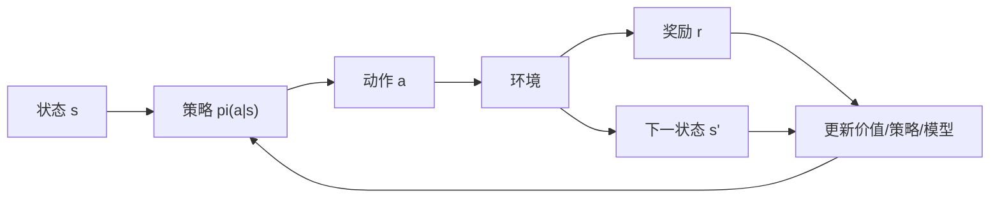
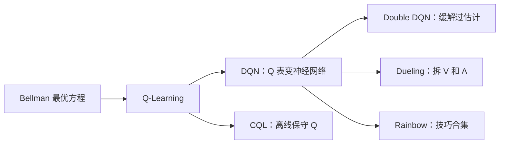
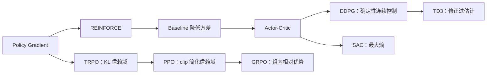
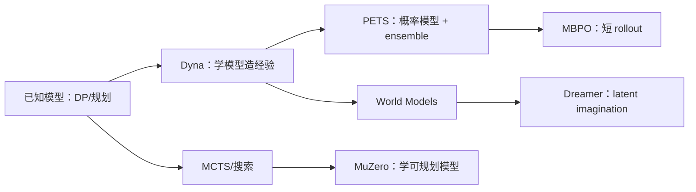
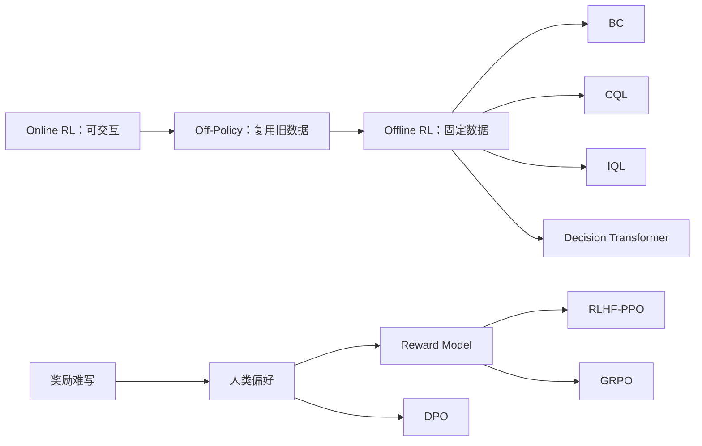
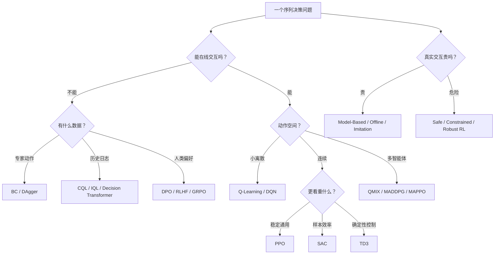

---
tags:
  - reinforcement-learning
  - review
  - knowledge-map
aliases:
  - RL统一复习地图
  - 强化学习总入口
created: 2026-05-15
---

# 强化学习统一复习地图

这份文档是 RL 复习的唯一主入口。目标是用最少结构回答五件事：

1. RL 到底在学什么？
2. 方法分支为什么这么多？
3. 每类方法适合什么场景？
4. 重要算法之间如何演化？
5. 最少要掌握哪些公式？

---

## 1. 一句话总览

强化学习研究的是：

> 智能体在环境中通过试错学习策略，使长期累计回报最大。

核心循环：

总目标：

$$
J(\pi)=\mathbb{E}_\pi\left[\sum_{t=0}^{\infty}\gamma^t r_t\right]
$$

---

## 2. RL 方法为什么会分叉

RL 方法多，不是因为名字多，而是因为问题约束不同。

| 分叉问题 | 产生的分支 | 典型方法 |
|---|---|---|
| 学价值还是直接学策略？ | Value-Based / Policy-Based / Actor-Critic | [[02-模块/Value-Based/Q-Learning|Q-Learning]]、[[02-模块/Value-Based/DQN|DQN]]、[[02-模块/Policy-Based/PPO|PPO]]、[[02-模块/Actor-Critic/SAC|SAC]] |
| 是否知道环境模型？ | Model-Free / Model-Based | [[02-模块/Value-Based/DQN|DQN]]、[[02-模块/Policy-Based/PPO|PPO]]、Dyna、[[02-模块/Model-Based/MBPO|MBPO]]、Dreamer |
| 能不能在线交互？ | Online / Offline RL | [[02-模块/Policy-Based/PPO|PPO]]、[[02-模块/Actor-Critic/SAC|SAC]]、[[02-模块/Value-Based/CQL|CQL]]、[[02-模块/Value-Based/IQL|IQL]]、Decision Transformer |
| 动作是离散还是连续？ | 离散控制 / 连续控制 | [[02-模块/Value-Based/DQN|DQN]]、[[02-模块/Policy-Based/PPO|PPO]]、[[02-模块/Actor-Critic/TD3|TD3]]、[[02-模块/Actor-Critic/SAC|SAC]] |
| 奖励好不好写？ | 经典 RL / 模仿学习 / RLHF | BC、[[02-模块/Imitation-Learning/IRL|IRL]]、GAIL、[[02-模块/Reward-Model/DPO|DPO]]、[[02-模块/Policy-Based/GRPO|GRPO]] |
| 是否有多个智能体？ | Single-Agent / Multi-Agent | [[02-模块/Multi-Agent/QMIX|VDN]]、[[02-模块/Multi-Agent/QMIX|QMIX]]、[[02-模块/Multi-Agent/MADDPG|MADDPG]]、[[02-模块/Multi-Agent/MAPPO|MAPPO]] |
| 是否有安全约束？ | Safe / Robust / Risk-Sensitive RL | Constrained RL、CVaR、Robust MDP |

记忆句：

> RL 的算法分支，本质上是在不同约束下解决”如何估计长期价值、如何改进策略、如何安全有效地获取数据”。

### 2.1 学价值 vs 学策略：两条不同的路

RL 的最终目标是**找到策略 π(a|s)，让智能体在状态 s 下选择动作 a，使长期累积奖励最大**。问题是怎么找到这个策略。

**路线一：先学”打分表”，再根据分数选动作（Value-Based）**

核心思想：不直接学”该做什么”，而是学”每个动作值多少分”，然后选分数最高的。

具体来说，学一个**动作-价值函数 Q(s, a)**：

$$Q(s, a) = \text{“在状态 } s \text{ 下执行动作 } a\text{，之后按最优策略走，能获得的期望累积奖励”}$$

有了 Q 函数，策略自然就出来了：

$$\pi(a|s) = \arg\max_a Q(s,a)$$

**符号说明**：
- $s$：当前状态（比如游戏画面）
- $a$：动作（比如”向左”、”向右”）
- $Q(s,a)$：在状态 $s$ 下执行动作 $a$ 的”打分”
- $\pi(a|s)$：策略函数，在状态 $s$ 下选择动作 $a$ 的规则
- $\arg\max_a$：选出让 $Q(s,a)$ 最大的那个 $a$

**比喻**：你拿到一张菜单，每道菜旁边标了好吃指数（Q 值），你直接选分数最高的那道菜。你不需要”学会点菜”，只需要”学会打分”。

**路线二：直接学”该做什么”（Policy-Based）**

核心思想：不打分，直接学一个策略函数，输入状态，输出动作（或动作的概率分布）。

$$\pi_\theta(a|s) = \text{在状态 } s \text{ 下选择动作 } a \text{ 的概率}$$

**符号说明**：
- $\pi_\theta$：策略函数，参数为 $\theta$（神经网络的权重）
- $\pi_\theta(a|s)$：在状态 $s$ 下，策略选择动作 $a$ 的概率
- $\theta$：策略网络的参数，通过训练不断更新

**比喻**：你不是拿到菜单打分，而是直接培养了一个”点菜直觉”——看到菜单就知道该点什么。

**两者的核心区别**：

| 维度 | Value-Based（学价值） | Policy-Based（学策略） |
|------|----------------------|----------------------|
| **学什么** | Q 函数：每个动作的”分数” | π 函数：直接输出动作 |
| **怎么选动作** | 选分数最高的（argmax） | 按概率采样或取最大概率 |
| **适合场景** | 离散动作（上下左右） | 连续动作（力的大小、角度） |
| **能否学随机策略** | ❌ 不能（只能选最优） | ✅ 可以（输出概率分布） |
| **训练稳定性** | 相对稳定 | 方差大，容易不稳定 |
| **代表算法** | [[02-模块/Value-Based/Q-Learning|Q-Learning]], [[02-模块/Value-Based/DQN|DQN]] | [[02-模块/Policy-Based/REINFORCE|REINFORCE]], [[02-模块/Policy-Based/PPO|PPO]] |

**为什么连续动作必须用 Policy-Based？**

假设控制机械臂，动作是力的大小 $a \in [0, 10]$ 牛顿。

- **Value-Based 的困境**：你需要对无穷多个可能的力（0.1, 0.11, 0.12, ...）都打一个 Q 分，然后选最大的。这做不到。
- **Policy-Based 的方案**：直接输出一个高斯分布的参数（均值 μ 和标准差 σ），然后从这个分布采样。

**Actor-Critic：两条路的结合**

既然两条路各有优缺点，为什么不结合？

- **Actor（演员）**：策略网络 $\pi_\theta(a|s)$，负责”选动作”（Policy-Based 的部分）
- **Critic（评论家）**：价值网络 $V_\phi(s)$ 或 $Q_\phi(s,a)$，负责”打分评价”（Value-Based 的部分）

**工作方式**：Actor 选动作 → 环境给反馈 → Critic 评价好坏 → Actor 根据评价调整策略。

### 2.2 “是否知道环境模型”是什么意思？

**环境模型 = 环境的”物理定律”**

环境模型指的是**状态转移函数**和**奖励函数**：

$$P(s'|s, a) = \text{在状态 } s \text{ 执行动作 } a \text{ 后，转移到状态 } s' \text{ 的概率}$$

$$R(s, a) = \text{在状态 } s \text{ 执行动作 } a \text{ 后，获得的即时奖励}$$

**符号说明**：
- $P(s'|s, a)$：转移概率，描述”如果我在这个状态做这个动作，下一步会变成什么状态”
- $R(s, a)$：奖励函数，描述”做这个动作能得到多少奖励”
- $s$：当前状态
- $a$：执行的动作
- $s'$：下一个状态

**比喻**：环境模型就像是游戏的”物理引擎”。如果你知道物理引擎的规则，你可以在脑子里模拟”如果我往左走，会发生什么”，而不需要真的去试。

**Model-Based vs Model-Free**：

| 维度 | Model-Based（知道/学习模型） | Model-Free（不知道模型） |
|------|---------------------------|------------------------|
| **知道什么** | 知道或学到了 $P(s'|s,a)$ 和 $R(s,a)$ | 只知道”我试了这个动作，得到了这个结果” |
| **能做什么** | 可以在脑子里”想象”未来 | 只能通过实际试错来学习 |
| **样本效率** | 高（可以脑补很多经验） | 低（每个经验都要真试） |
| **复杂度** | 模型学不准会很惨 | 简单粗暴，但需要大量试错 |
| **代表算法** | [[02-模块/Model-Based/Dyna-Q|Dyna-Q]], MuZero, Dreamer | [[02-模块/Value-Based/DQN|DQN]], [[02-模块/Policy-Based/PPO|PPO]], [[02-模块/Actor-Critic/SAC|SAC]] |

### 2.3 分类维度是多维交叉的，不是单一树状结构

**重要提醒**：上面的分支**不在同一个维度上**！它们是多维交叉的：

| 分类维度 | 可选值 | 例子 |
|---------|--------|------|
| **学什么（优化目标）** | Value-Based / Policy-Based / Actor-Critic | [[02-模块/Value-Based/DQN|DQN]] 是 Value-Based，[[02-模块/Policy-Based/PPO|PPO]] 是 Policy-Based |
| **是否知道环境模型** | Model-Free / Model-Based | [[02-模块/Value-Based/DQN|DQN]] 是 Model-Free，MuZero 是 Model-Based |
| **数据怎么用** | On-Policy / Off-Policy | [[02-模块/Policy-Based/PPO|PPO]] 是 On-Policy，[[02-模块/Value-Based/DQN|DQN]] 是 Off-Policy |
| **数据从哪来** | Online / Offline | [[02-模块/Actor-Critic/SAC|SAC]] 是 Online，[[02-模块/Value-Based/CQL|CQL]] 是 Offline |
| **动作空间** | 离散 / 连续 | [[02-模块/Value-Based/DQN|DQN]] 是离散，[[02-模块/Actor-Critic/DDPG|DDPG]] 是连续 |
| **智能体数量** | Single-Agent / Multi-Agent | [[02-模块/Policy-Based/PPO|PPO]] 是单智能体，[[02-模块/Multi-Agent/MAPPO|MAPPO]] 是多智能体 |
| **奖励来源** | 人工设计 / 学习 / 人类偏好 | 传统 RL / [[02-模块/Imitation-Learning/IRL|IRL]] / RLHF |

**正确的理解方式**：每个算法是这些维度的一个**组合**。比如：

- **[[02-模块/Value-Based/DQN|DQN]]** = Value-Based + Model-Free + Off-Policy + Online + 离散动作
- **[[02-模块/Policy-Based/PPO|PPO]]** = Actor-Critic (Policy-Based + Value-Based) + Model-Free + On-Policy + Online + 连续/离散
- **[[02-模块/Actor-Critic/SAC|SAC]]** = Actor-Critic + Model-Free + Off-Policy + Online + 连续动作
- **[[02-模块/Value-Based/CQL|CQL]]** = Actor-Critic + Model-Free + Off-Policy + **Offline** + 连续动作

---

## 3. 总分类地图

```mermaid
graph TD
    RL["Reinforcement Learning"]

    RL --> Foundation["基础：MDP + Bellman"]
    Foundation --> MC["MC：完整回报"]
    Foundation --> TD["TD：一步自举"]
    Foundation --> DP["DP：已知模型规划"]

    RL --> Value["Value-Based：学 Q"]
    Value --> SARSA["SARSA"]
    Value --> QL["Q-Learning"]
    Value --> DQN["DQN / Double / Dueling / Rainbow"]
    Value --> CQL["CQL：Offline 保守 Q"]

    RL --> Policy["Policy-Based：直接学 pi"]
    Policy --> REINFORCE["REINFORCE"]
    Policy --> TRPO["TRPO"]
    Policy --> PPO["PPO"]
    Policy --> DPO["DPO"]
    Policy --> GRPO["GRPO"]

    RL --> AC["Actor-Critic：Actor + Critic"]
    AC --> A2C["A2C/A3C"]
    AC --> DDPG["DDPG"]
    AC --> TD3["TD3"]
    AC --> SAC["SAC"]

    RL --> MB["Model-Based：学模型/规划"]
    MB --> Dyna["Dyna-Q"]
    MB --> PETS["PETS"]
    MB --> MBPO["MBPO"]
    MB --> Dreamer["Dreamer/MuZero"]

    RL --> Special["特殊场景"]
    Special --> Offline["Offline RL"]
    Special --> IL["Imitation / IRL"]
    Special --> MARL["Multi-Agent RL"]
    Special --> Safe["Safe / Robust RL"]
    Special --> RLHF["RLHF / Preference Optimization"]
```

> **重要提醒**：下面的分类图把不同维度的分支并列展示了，但实际上它们是**多维交叉**的（详见 2.3 节）。比如 [[02-模块/Value-Based/DQN|DQN]] 同时是 Value-Based + Model-Free + Off-Policy + Online + 离散动作。这个图只是为了快速浏览各分支的代表算法。

---

## 4. 各方法分支的作用

| 分支                | 主要作用                  | 适合场景                   | 不适合场景               | 代表方法                   |     |
| ----------------- | --------------------- | ---------------------- | ------------------- | ---------------------- | --- |
| Value-Based       | 学 $Q(s,a)$，再选最大 Q 的动作 | 离散动作、游戏、网格世界           | 高维连续动作              | [[02-模块/Value-Based/SARSA|SARSA]]、[[02-模块/Value-Based/Q-Learning|Q-Learning]]、[[02-模块/Value-Based/DQN|DQN]]   |     |
| Policy-Based      | 直接优化 $\pi_\theta(as)$ | 连续动作、随机策略、LLM token 策略 | 样本少且奖励稀疏时方差大        | [[02-模块/Policy-Based/REINFORCE|REINFORCE]]、[[02-模块/Policy-Based/TRPO|TRPO]]、[[02-模块/Policy-Based/PPO|PPO]]     |     |
| Actor-Critic      | Actor 行动，Critic 评价    | 现代 deep RL 主干、连续控制     | Critic 不准时会误导 Actor | [[02-模块/Actor-Critic/A2C|A2C]]、[[02-模块/Actor-Critic/DDPG|DDPG]]、[[02-模块/Actor-Critic/TD3|TD3]]、[[02-模块/Actor-Critic/SAC|SAC]]       |     |
| Model-Based       | 学环境模型，用模型规划或生成数据      | 真实交互昂贵、机器人控制           | 模型误差大、长 horizon     | Dyna、[[02-模块/Model-Based/PETS|PETS]]、[[02-模块/Model-Based/MBPO|MBPO]]、Dreamer |     |
| Offline RL        | 固定数据集上学策略             | 医疗、自动驾驶日志、历史数据         | 需要主动探索的新任务          | BC、[[02-模块/Value-Based/CQL|CQL]]、[[02-模块/Value-Based/IQL|IQL]]、DT          |     |
| Imitation / [[02-模块/Imitation-Learning/IRL|IRL]]   | 奖励难写时利用专家             | 有专家演示                  | 专家数据差或覆盖不足          | BC、DAgger、[[02-模块/Imitation-Learning/IRL|IRL]]、GAIL     |     |
| Multi-Agent RL    | 多个智能体共同学习             | 协作、竞争、交通、游戏            | 单智能体任务              | [[02-模块/Multi-Agent/QMIX|VDN]]、[[02-模块/Multi-Agent/QMIX|QMIX]]、[[02-模块/Multi-Agent/MADDPG|MADDPG]]、[[02-模块/Multi-Agent/MAPPO|MAPPO]]  |     |
| RLHF / Preference | 用人类偏好或验证器优化策略         | LLM 对齐、推理模型            | 没有偏好/验证信号           | [[02-模块/Policy-Based/PPO|PPO]]、[[02-模块/Reward-Model/DPO|DPO]]、[[02-模块/Policy-Based/GRPO|GRPO]]           |     |

> **深度演化**:Offline RL (BC→[[02-模块/Value-Based/BCQ|BCQ]]→[[02-模块/Value-Based/CQL|CQL]]→[[02-模块/Value-Based/IQL|IQL]]→DT) 和 RLHF ([[02-模块/Policy-Based/PPO|PPO]]→[[02-模块/Reward-Model/DPO|DPO]]→[[02-模块/Policy-Based/GRPO|GRPO]]→[[02-模块/Policy-Based/DAPO|DAPO]]) 的完整演化详见 [Offline-RL与RLHF-偏好优化演化全景.md](Offline-RL与RLHF-偏好优化演化全景.md)。

---

## 5. 重要演化关系

### 5.1 Value-Based 主线

记忆：

- [[02-模块/Value-Based/Q-Learning|Q-Learning]]：直接学最优 $Q^*$。
- [[02-模块/Value-Based/DQN|DQN]]：让 [[02-模块/Value-Based/Q-Learning|Q-Learning]] 能处理图像等高维状态。
- Double/Dueling/Rainbow：解决 [[02-模块/Value-Based/DQN|DQN]] 的稳定性和估计偏差。
- [[02-模块/Value-Based/CQL|CQL]]：Offline 场景下别相信数据外动作的高 Q。

### 5.2 Policy / Actor-Critic 主线

记忆：

- [[02-模块/Policy-Based/REINFORCE|REINFORCE]]：回报高就提高动作概率，但方差大。
- Actor-Critic：用 Critic 估计优势，降低[[01-原子/策略梯度|策略梯度]]方差。
- [[02-模块/Policy-Based/PPO|PPO]]：控制策略更新幅度，是通用稳定基线。
- [[02-模块/Actor-Critic/SAC|SAC]]：[[01-原子/最大熵原理|最大熵]]，兼顾回报和探索，连续控制常用。
- [[02-模块/Policy-Based/GRPO|GRPO]]：[[02-模块/Policy-Based/PPO|PPO]] 思路用于 LLM，去掉昂贵 Critic。

### 5.3 Model-Based 主线

记忆：

- Model-Free：直接从经验学。
- Model-Based：先学世界，再在模型中试错或规划。
- 难点：模型误差会累积，所以常用短 rollout、ensemble、latent model。

### 5.4 Offline / RLHF 主线

记忆：

- Offline RL 的核心问题：数据外动作的价值不可信。
- RLHF 的核心问题：人类目标难写成奖励，用偏好或规则给反馈。
- **完整演化**:见 [Offline-RL与RLHF-偏好优化演化全景.md](Offline-RL与RLHF-偏好优化演化全景.md) (BC→[[02-模块/Value-Based/BCQ|BCQ]]→[[02-模块/Value-Based/CQL|CQL]]→[[02-模块/Value-Based/IQL|IQL]]→DT; [[02-模块/Policy-Based/PPO|PPO]]→[[02-模块/Reward-Model/DPO|DPO]]→[[02-模块/Policy-Based/GRPO|GRPO]]→[[02-模块/Policy-Based/DAPO|DAPO]],含关键公式与 2025-2026 前沿)

---

## 6. 最少公式清单

> **看不懂符号？** 见 [[01-原子/数学符号表]] — 所有 RL 数学符号的大白话速查。

只要先掌握这些公式，就能串起大多数算法。

### 6.1 Return（累积回报）

$$
G_t=\sum_{k=0}^{\infty}\gamma^k r_{t+k}
$$

**符号说明**：
- $G_t$：从时刻 $t$ 开始的**累积回报**（Return），表示未来所有奖励的加权和
- $\gamma$：**折扣因子**（0 ≤ γ ≤ 1），衡量未来奖励的重要性。γ=0 表示只看眼前，γ=1 表示未来和现在同等重要
- $r_{t+k}$：在时刻 $t+k$ 获得的**即时奖励**（Reward）
- $k$：时间步的偏移量，$k=0$ 表示当前时刻，$k=1$ 表示下一时刻

**直觉理解**：累积回报 = 现在的奖励 + γ × 下一步的奖励 + γ² × 下两步的奖励 + ...

### 6.2 Value / Q / Advantage（价值函数）

$$
V^\pi(s)=\mathbb{E}_\pi[G_t|s_t=s]
$$

**符号说明**：
- $V^\pi(s)$：**状态价值函数**（State Value Function），在策略 $\pi$ 下，从状态 $s$ 出发能获得的期望累积回报
- $\pi$：**策略**（Policy），智能体选择动作的规则
- $\mathbb{E}_\pi$：在策略 $\pi$ 下取**期望**（对所有可能的未来轨迹求平均）
- $G_t$：从时刻 $t$ 开始的累积回报
- $s_t=s$：当前状态为 $s$

**直觉理解**：$V^\pi(s)$ 表示"如果你现在在状态 $s$，按策略 $\pi$ 走，平均能获得多少回报"

$$
Q^\pi(s,a)=\mathbb{E}_\pi[G_t|s_t=s,a_t=a]
$$

**符号说明**：
- $Q^\pi(s,a)$：**动作价值函数**（Action Value Function），在策略 $\pi$ 下，从状态 $s$ 执行动作 $a$ 后，能获得的期望累积回报
- $a_t=a$：在时刻 $t$ 执行动作 $a$
- 其他符号同上

**直觉理解**：$Q^\pi(s,a)$ 表示"如果你现在在状态 $s$，先执行动作 $a$，然后按策略 $\pi$ 走，平均能获得多少回报"

$$
A^\pi(s,a)=Q^\pi(s,a)-V^\pi(s)
$$

**符号说明**：
- $A^\pi(s,a)$：**[[01-原子/优势函数|优势函数]]**（Advantage Function），在状态 $s$ 下执行动作 $a$ 的**优势**——这个动作比平均水平好多少
- $Q^\pi(s,a)$：动作价值——执行动作 $a$ 能获得多少累积奖励
- $V^\pi(s)$：状态价值——在状态 $s$ 下按策略 $\pi$ 走的**平均**累积奖励

**直觉理解**：优势 = "这个动作的分数" - "这个状态的平均分"。正优势表示比平均好，负优势表示比平均差。

### 6.3 Bellman（贝尔曼方程）

$$
V^\pi(s)=\sum_a\pi(a|s)\sum_{s'}P(s'|s,a)[R+\gamma V^\pi(s')]
$$

**符号说明**：
- $V^\pi(s)$：策略 $\pi$ 下，状态 $s$ 的**价值**
- $\pi(a|s)$：策略 $\pi$ 在状态 $s$ 下选择动作 $a$ 的**概率**
- $P(s'|s,a)$：环境的**转移概率**——在状态 $s$ 执行动作 $a$ 后，转移到状态 $s'$ 的概率
- $R$：执行动作后获得的**即时奖励**（这里简写为 $R(s,a)$）
- $\gamma$：**折扣因子**（0 ≤ γ ≤ 1）
- $s'$：**下一个状态**
- $V^\pi(s')$：下一个状态 $s'$ 在策略 $\pi$ 下的价值

**直觉理解**：当前状态的价值 = 所有可能动作的加权平均 × 每个动作的（即时奖励 + 折扣后的未来价值）

$$
Q^*(s,a)=\sum_{s'}P(s'|s,a)[R+\gamma\max_{a'}Q^*(s',a')]
$$

**符号说明**：
- $Q^*(s,a)$：**最优动作价值函数**——在状态 $s$ 执行动作 $a$，之后按**最优策略**走，能获得的期望累积奖励
- $\max_{a'} Q^*(s', a')$：在下一个状态 $s'$，选择**最好的动作** $a'$ 所能获得的价值
- 其他符号同上

**直觉理解**：最优 Q 值 = 即时奖励 + 折扣后的"下一步的最优 Q 值"

### 6.4 TD Error（时序差分误差）

$$
\delta_t=r_t+\gamma V(s_{t+1})-V(s_t)
$$

**符号说明**：
- $\delta_t$：**[[01-原子/TD误差|TD 误差]]**（Temporal Difference Error），表示"预测"和"实际"之间的差距
- $r_t$：在时刻 $t$ 执行动作后获得的**即时奖励**
- $\gamma$：**折扣因子**
- $V(s_{t+1})$：**下一个状态** $s_{t+1}$ 的价值估计
- $V(s_t)$：**当前状态** $s_t$ 的价值估计

**直觉理解**：[[01-原子/TD误差|TD 误差]] = "我们认为应该得到的"（即时奖励 + 下一步的价值） - "我们之前预测的"（当前价值）。如果 [[01-原子/TD误差|TD 误差]] > 0，说明预测太低了，应该调高；如果 < 0，说明预测太高了，应该调低。

### 6.5 SARSA / Q-Learning（表格型 TD 控制）

$$
Q(s,a)\leftarrow Q(s,a)+\alpha[r+\gamma Q(s',a')-Q(s,a)]
$$

**符号说明**：
- $Q(s,a)$：动作价值函数，在状态 $s$ 下执行动作 $a$ 的价值
- $\leftarrow$：更新符号，表示用右边的值更新左边
- $\alpha$：**学习率**（Learning Rate），控制更新的步长（0 < α ≤ 1）
- $r$：执行动作后获得的**即时奖励**
- $\gamma$：**折扣因子**
- $s'$：**下一个状态**
- $a'$：在下一个状态 $s'$ 下，**按当前策略选择的动作**（SARSA 是 On-Policy，所以用实际执行的动作）
- $r+\gamma Q(s',a')-Q(s,a)$：**TD 误差**

**直觉理解**：SARSA 更新规则：新的 Q 值 = 旧的 Q 值 + 学习率 × TD 误差。TD 误差 = 即时奖励 + 折扣后的下一步 Q 值（按策略走的） - 当前 Q 值

$$
Q(s,a)\leftarrow Q(s,a)+\alpha[r+\gamma\max_{a'}Q(s',a')-Q(s,a)]
$$

**符号说明**：
- $\max_{a'}Q(s',a')$：在下一个状态 $s'$ 下，选择**最优动作** $a'$ 所能获得的最大 Q 值（Q-Learning 是 Off-Policy，所以假设下一步选最优）
- 其他符号同上

**直觉理解**：Q-Learning 更新规则：新的 Q 值 = 旧的 Q 值 + 学习率 × TD 误差。TD 误差 = 即时奖励 + 折扣后的下一步**最优** Q 值 - 当前 Q 值

### 6.6 Policy Gradient（策略梯度定理）

$$
\nabla_\theta J(\theta) = \mathbb{E}_{\pi_\theta} \left[ \sum_t \nabla_\theta \log \pi_\theta(a_t | s_t) \cdot A^{\pi_\theta}(s_t, a_t) \right]
$$

**符号说明**：
- $\nabla_\theta J(\theta)$：目标函数 $J(\theta)$ 对参数 $\theta$ 的**梯度**——告诉你参数应该往哪个方向调
- $J(\theta)$：**目标函数**——策略 $\pi_\theta$ 的期望累积奖励，越大越好
- $\theta$：策略网络的**参数**（神经网络的权重）
- $\pi_\theta(a_t | s_t)$：当前策略在状态 $s_t$ 下选择动作 $a_t$ 的**概率**
- $\log \pi_\theta(a_t | s_t)$：概率的**对数**——对概率求梯度时需要取对数（这是数学技巧，叫 log-derivative trick）
- $\nabla_\theta \log \pi_\theta(a_t | s_t)$：对数概率对参数的梯度——告诉你"怎么调参数能让这个动作的概率增加"
- $A^{\pi_\theta}(s_t, a_t)$：**优势函数**——动作 $a_t$ 相对于平均水平的优势
- $\mathbb{E}_{\pi_\theta}$：在策略 $\pi_\theta$ 下取**期望**（对所有可能的轨迹求平均）

**直觉理解**：如果一个动作比平均水平好（A > 0），就增加它的概率；如果比平均水平差（A < 0），就减少它的概率。

### 6.7 PPO（近端策略优化）

$$
L^{CLIP}(\theta) = \mathbb{E}_t \left[ \min\left( r_t(\theta) \hat{A}_t, \; \text{clip}(r_t(\theta), 1-\epsilon, 1+\epsilon) \hat{A}_t \right) \right]
$$

**符号说明**：
- $L^{CLIP}(\theta)$：PPO 的**目标函数**，最大化它来更新策略参数 $\theta$
- $r_t(\theta) = \frac{\pi_\theta(a_t | s_t)}{\pi_{\theta_{old}}(a_t | s_t)}$：**概率比**——新策略选这个动作的概率 / 旧策略选这个动作的概率
- $\pi_\theta$：**新策略**（正在优化的策略）
- $\pi_{\theta_{old}}$：**旧策略**（收集数据时用的策略，固定不变）
- $\hat{A}_t$：优势函数的**估计值**（通常用 GAE 计算）
- $\text{clip}(x, 1-\epsilon, 1+\epsilon)$：**裁剪函数**——把 $x$ 限制在 $[1-\epsilon, 1+\epsilon]$ 范围内
- $\epsilon$：**裁剪范围**（通常取 0.1 或 0.2），控制策略更新的幅度
- $\min(...)$：取两个值中**较小的**——确保策略不会更新过头

**直觉理解**：
- 如果动作好（$\hat{A}_t > 0$），增加它的概率，但**不能超过 $1+\epsilon$**
- 如果动作差（$\hat{A}_t < 0$），减少它的概率，但**不能低于 $1-\epsilon$**
- 这样确保每次更新都是"小步慢跑"，不会步子太大导致崩溃

### 6.8 SAC（软演员-评论家，最大熵目标）

$$
J(\pi) = \mathbb{E}_{\tau \sim \pi} \left[ \sum_{t=0}^T r(s_t, a_t) + \alpha \mathcal{H}(\pi(\cdot | s_t)) \right]
$$

**符号说明**：
- $J(\pi)$：**目标函数**，最大化它来训练策略
- $\tau \sim \pi$：按策略 $\pi$ 采样的**轨迹**（一系列状态和动作）
- $r(s_t, a_t)$：在状态 $s_t$ 执行动作 $a_t$ 获得的**即时奖励**
- $\alpha$：**温度参数**——控制"探索 vs 利用"的权衡。α 大则鼓励探索，α 小则鼓励利用
- $\mathcal{H}(\pi(\cdot | s_t))$：策略在状态 $s_t$ 下的**熵**——衡量策略的随机性
- $\mathcal{H}(\pi(\cdot | s_t)) = -\sum_a \pi(a|s_t) \log \pi(a|s_t)$：熵的具体计算
- $T$：轨迹的**长度**（总步数）

**直觉理解**：不仅要获得高奖励，还要保持策略的随机性（鼓励探索）。α 控制"多探索"还是"多利用已知的好动作"。

### 6.9 Offline RL 的保守思想

$$
a\notin \text{support}(\mathcal{D})
\Rightarrow Q(s,a)\ \text{不可信}
$$

**符号说明**：
- $a$：动作
- $\text{support}(\mathcal{D})$：数据集 $\mathcal{D}$ 中**出现过的动作的集合**
- $\notin$：不属于
- $\Rightarrow$：蕴含，表示"如果...那么..."
- $Q(s,a)$：动作价值函数
- $\text{不可信}$：Q 值估计不准确，可能过高

**直觉理解**：在 Offline RL 中，如果某个动作在数据集中没出现过，我们就不知道它好不好，所以不能相信 Q 网络对它的估计（Q 网络会"瞎猜"，通常会高估）。

### 6.10 GRPO（组相对策略优化）

$$
A_i=
\frac{r_i-\text{mean}(r_{1:G})}
{\text{std}(r_{1:G})}
$$

**符号说明**：
- $A_i$：第 $i$ 个动作的**优势**（Advantage）
- $r_i$：第 $i$ 个动作获得的**奖励**
- $r_{1:G}$：一组 $G$ 个动作的奖励集合 $\{r_1, r_2, ..., r_G\}$
- $\text{mean}(r_{1:G})$：这组奖励的**平均值**
- $\text{std}(r_{1:G})$：这组奖励的**标准差**（衡量奖励的分散程度）

**直觉理解**：GRPO 不用 Critic 网络来估计优势，而是直接比较一组动作的相对好坏。优势 = (这个动作的奖励 - 平均奖励) / 标准差。正优势表示比平均好，负优势表示比平均差。

---

## 7. 场景选择树

---

## 8. 推荐学习顺序

### 第一遍：建立全景

1. MDP、Return、Value、Q、Advantage。
2. Bellman 方程和 TD error。
3. 区分 Value-Based、Policy-Based、Actor-Critic。
4. 看懂 DQN、PPO、SAC、Offline RL、RLHF 在地图上的位置。

### 第二遍：抓住主线

1. DQN 系：Q-Learning -> [[02-模块/Value-Based/DQN|DQN]] -> Double/Dueling/Rainbow -> [[02-模块/Value-Based/CQL|CQL]]。
2. Policy/AC 系：[[02-模块/Policy-Based/REINFORCE|REINFORCE]] -> Actor-Critic -> [[02-模块/Policy-Based/PPO|PPO]] -> [[02-模块/Actor-Critic/SAC|SAC]]。
3. 数据约束系：Online -> Off-policy -> Offline -> RLHF/Preference。

### 第三遍：开始能用

1. 手推 Bellman、Policy Gradient、[[02-模块/Policy-Based/PPO|PPO]]、[[02-模块/Actor-Critic/SAC|SAC]]。
2. 实现 [[02-模块/Value-Based/Q-Learning|Q-Learning]]、[[02-模块/Value-Based/DQN|DQN]]、[[02-模块/Policy-Based/PPO|PPO]]、[[02-模块/Actor-Critic/SAC|SAC]] 的最小版本。
3. 学会看实验：sample efficiency、return curve、seed variance、ablation。

---

## 9. 面试准备：手推公式与核心代码

面试中有可能让你手推公式或写核心代码，但通常不会要求从零写完整 [[02-模块/Policy-Based/PPO|PPO]]/[[02-模块/Actor-Critic/SAC|SAC]] 工程。更常见的是：解释关键公式、推到关键一步、写训练循环或损失函数的核心片段。

### 9.1 最该会手推的公式

| 优先级 | 公式/主题 | 面试常问点 |
|---|---|---|
| 必会 | [[01-原子/Bellman方程|Bellman 方程]] | $V^\pi$、$Q^\pi$、$Q^*$ 的递推含义 |
| 必会 | TD Error | TD 和 MC 的区别，为什么 TD 是 bootstrap |
| 必会 | [[02-模块/Value-Based/SARSA|SARSA]] / [[02-模块/Value-Based/Q-Learning|Q-Learning]] | [[02-模块/Value-Based/SARSA|SARSA]] 为什么 on-policy，[[02-模块/Value-Based/Q-Learning|Q-Learning]] 为什么 off-policy |
| 必会 | Policy Gradient | log-derivative trick，为什么能写成 $\nabla\log\pi$ |
| 必会 | Baseline / Advantage | baseline 为什么不改变期望，advantage 的作用 |
| 高频 | [[02-模块/Policy-Based/PPO|PPO]] Clip | ratio 和 clip 如何限制策略更新幅度 |
| 高频 | [[01-原子/GAE|GAE]] | $\lambda$ 如何控制偏差-方差 |
| 高频 | [[02-模块/Actor-Critic/SAC|SAC]] [[01-原子/最大熵原理|最大熵]] | 为什么加 entropy，$\alpha$ 控制什么 |
| 高频 | Offline RL / [[02-模块/Value-Based/CQL|CQL]] | 为什么离线数据外动作容易 Q 过估计 |
| 加分 | [[02-模块/Policy-Based/GRPO|GRPO]] / [[02-模块/Reward-Model/DPO|DPO]] | LLM RLHF 中为什么减少 Critic 或直接优化偏好 |

### 9.2 最该会写的核心代码

不用背完整项目，重点准备这些短函数或伪代码：

| 代码点 | 要能写出什么 |
|---|---|
| [[01-原子/epsilon-greedy|epsilon-greedy]] | 按 $\epsilon$ 随机探索，否则选 $\arg\max_a Q(s,a)$ |
| Tabular [[02-模块/Value-Based/Q-Learning|Q-Learning]] | 一行更新：$Q \leftarrow Q+\alpha[r+\gamma\max Q'-Q]$ |
| Replay Buffer | `push`、`sample batch`、容量满时覆盖 |
| [[02-模块/Value-Based/DQN|DQN]] train step | 计算 target Q、MSE loss、反向传播 |
| Target Network | hard update 或 soft update |
| [[01-原子/GAE|GAE]] | 反向循环累计 advantage |
| [[02-模块/Policy-Based/PPO|PPO]] loss | ratio、clip、policy loss、value loss、entropy bonus |
| [[02-模块/Actor-Critic/SAC|SAC]] 核心 | soft Q target、actor loss、temperature/entropy 项 |

### 9.3 面试复习标准

达到下面程度就够用：

1. 看到公式能解释每一项的直觉。
2. 能从 Bellman 推到 TD、[[02-模块/Value-Based/SARSA|SARSA]]、[[02-模块/Value-Based/Q-Learning|Q-Learning]]。
3. 能从 Policy Gradient 推到 baseline、advantage、[[02-模块/Policy-Based/PPO|PPO]]。
4. 能写出 [[02-模块/Value-Based/Q-Learning|Q-Learning]]、[[02-模块/Value-Based/DQN|DQN]] train step、[[01-原子/GAE|GAE]]、[[02-模块/Policy-Based/PPO|PPO]] clipped loss 的核心代码。
5. 能说清 [[02-模块/Value-Based/DQN|DQN]]、[[02-模块/Policy-Based/PPO|PPO]]、[[02-模块/Actor-Critic/SAC|SAC]]、[[02-模块/Value-Based/CQL|CQL]]、[[02-模块/Policy-Based/GRPO|GRPO]] 分别解决什么痛点。

---

## 10. 不要漏掉但不必一开始深挖

| 主题 | 什么时候补 |
|---|---|
| Bandit / Contextual Bandit / OPE | 做推荐、广告、日志评估时 |
| POMDP / RNN Policy / Belief State | 状态不可完全观测时 |
| Credit Assignment / Reward Shaping | 长序列、稀疏奖励时 |
| Representation Learning | 图像、语言、多模态状态时 |
| Safe / Robust / Risk-Sensitive RL | 医疗、自动驾驶、金融等高风险场景 |
| Multi-Agent RL | 多个 agent 互相影响时 |

---

## 11. 展开阅读

这份主文档用于快速复习和建立统一框架。需要展开时，先看单算法笔记，再看演化综述串线。

### 单算法笔记
- [[01-原子/Bellman方程]]：动态规划的核心方程。
- [[01-原子/TD误差]]：Bellman方程的采样形式。
- [[01-原子/策略梯度]]、[[01-原子/优势函数]]、[[01-原子/GAE]]：策略优化的基础组件。
- [[02-模块/Value-Based/DQN]]、[[02-模块/Policy-Based/PPO]]、[[02-模块/Actor-Critic/SAC]]：三条主线代表算法。
- [[02-模块/Policy-Based/GRPO]]：大模型 RL/RLHF 相关补充。

### 演化综述（03-流程/）

每条主线从历史源头讲到 2025-2026 前沿，含演化逻辑、关键公式和优缺点：

- [[03-流程/Value-Based演化史]]：Bellman → [[02-模块/Value-Based/Q-Learning|Q-Learning]] → [[02-模块/Value-Based/DQN|DQN]] → Rainbow → [[02-模块/Value-Based/CQL|CQL]] → [[02-模块/Value-Based/IQL|IQL]] → Decision Transformer → Diffusion-RL
- [[03-流程/Policy-AC演化史]]：[[02-模块/Policy-Based/REINFORCE|REINFORCE]] → AC → [[02-模块/Policy-Based/TRPO|TRPO]] → [[02-模块/Policy-Based/PPO|PPO]] → [[02-模块/Actor-Critic/DDPG|DDPG]] → [[02-模块/Actor-Critic/TD3|TD3]] → [[02-模块/Actor-Critic/SAC|SAC]] → [[02-模块/Policy-Based/GRPO|GRPO]] → [[02-模块/Policy-Based/DAPO|DAPO]]
- [[03-流程/Model-Based演化史]]：DP → Dyna → [[02-模块/Model-Based/PETS|PETS]] → [[02-模块/Model-Based/MBPO|MBPO]] → Dreamer → MuZero → Genie → GameNGen
- [[03-流程/Offline-RL与RLHF演化史]]：BC → [[02-模块/Value-Based/CQL|CQL]] → [[02-模块/Value-Based/IQL|IQL]] → DT → RLHF → [[02-模块/Reward-Model/DPO|DPO]] → [[02-模块/Policy-Based/GRPO|GRPO]] → [[02-模块/Policy-Based/DAPO|DAPO]] → SimPO
- [[03-流程/MARL全景综述]]：博弈论基础 → [[02-模块/Value-Based/IQL|IQL]] → [[02-模块/Multi-Agent/QMIX|VDN]] → [[02-模块/Multi-Agent/QMIX|QMIX]] → COMA → [[02-模块/Multi-Agent/MADDPG|MADDPG]] → [[02-模块/Multi-Agent/MAPPO|MAPPO]] → AlphaStar → CICERO
