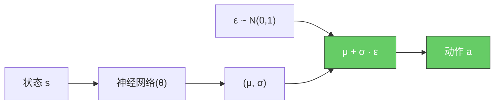

---
tags:
  - atomic
  - reparameterization-trick
  - sac
  - vae
created: 2026-06-22
---

# 重参数化技巧

> 通过重参数化，让随机采样操作可微分。SAC和VAE的核心技术。

---

## 核心思想

**问题**：在[[01-原子/策略梯度|策略梯度]]中，我们需要计算 $\nabla_\theta \mathbb{E}_{a \sim \pi_\theta}[f(a)]$，但 $a$ 是从 $\pi_\theta$ 采样的，采样操作不可微分。

**解决方案**：重参数化，将随机性从采样操作中分离出来。

### 原始形式（不可微分）

$$a \sim \pi_\theta(\cdot|s)$$


<!-- mmd-zoom:d1 -->
> 🔍 [缩放查看本图（可平移/缩放）](重参数化技巧.md.mermaid.html#d1)

采样操作 $\sim$ 不可微分——你没法问"稍微调一下 $\theta$，抽到的 $a$ 会怎么变"，因为同样的参数每次抽到的 $a$ 都不一样。

### 重参数化形式（可微分）

$$a = g_\theta(\epsilon, s), \quad \epsilon \sim p(\epsilon)$$

其中：
- $\epsilon$ 是从固定分布 $p(\epsilon)$ 采样的噪声（跟 $\theta$ 无关）
- $g_\theta$ 是可微分的确定性函数
- $a$ 是确定性输出，可以反向传播



<!-- mmd-zoom:d2 -->
> 🔍 [缩放查看本图（可平移/缩放）](重参数化技巧.md.mermaid.html#d2)

全程可微 ✅ —— 梯度可以从 $a$ 一路回传到 $\theta$。

### $g_\theta$ 到底是什么？

**$g_\theta$ 不是额外找的函数——它就是你的策略网络本身。** 它只是"从 $\epsilon$ 到 $a$ 的那段确定性计算"：

$$
g_\theta(\epsilon, s) = \underbrace{\mu_\theta(s)}_{\text{网络输出的均值}} + \underbrace{\sigma_\theta(s)}_{\text{网络输出的标准差}} \cdot \epsilon
$$

两种写法在**统计上完全等价**（抽出来的 $a$ 服从同样的分布），但第二种把"随机性"和"参数 $\theta$ 的影响"分开了：
- $\epsilon$ 的采样与 $\theta$ 无关 → 不阻断梯度
- $\mu_\theta, \sigma_\theta$ 都是 $\theta$ 的函数 → 梯度可以正常回传

---

## 高斯策略的重参数化

### 原始形式

$$\pi_\theta(a|s) = \mathcal{N}(a; \mu_\theta(s), \sigma_\theta(s)^2)$$

采样：$a \sim \mathcal{N}(\mu_\theta(s), \sigma_\theta(s)^2)$

### 重参数化形式

$$\epsilon \sim \mathcal{N}(0, 1)$$
$$a = \mu_\theta(s) + \sigma_\theta(s) \cdot \epsilon$$

**效果**：
- $\epsilon$ 的采样与 $\theta$ 无关
- $a$ 是 $\theta$ 的确定性函数，可以反向传播

### 具体代码示例

假设 SAC 的策略网络是个两层 MLP，整个 forward pass 就是 $g_\theta(\epsilon, s)$：

```
s → Linear(4, 64) → ReLU → Linear(64, 2) → (μ, log_σ)
                                              ↓
                               σ = exp(log_σ)   # 保证正数
                               ε = randn()       # 标准正态随机数
                               a = μ + σ * ε     # ← 这就是 g_θ(ε, s)
                               a = tanh(a)       # 限制到 [-1, 1]
```

每一步（矩阵乘法、ReLU、exp、乘法、加法、tanh）都有导数，所以可以用链式法则算 $\frac{\partial a}{\partial \theta}$，从而更新网络参数。

---

## 在SAC中的应用

[[02-模块/Actor-Critic/SAC|SAC]] 使用高斯策略：

$$\pi_\phi(a|s) = \mathcal{N}(a; \mu_\phi(s), \sigma_\phi(s)^2)$$

**重参数化**：

$$\epsilon \sim \mathcal{N}(0, 1)$$
$$a = \mu_\phi(s) + \sigma_\phi(s) \cdot \epsilon$$
$$a = \tanh(a) \quad \text{（限制动作范围）}$$

**Actor损失**：

$$J_\pi(\phi) = \mathbb{E}_{s \sim \mathcal{D}, \epsilon \sim \mathcal{N}}\left[\alpha \log \pi_\phi(a|s) - Q_\psi(s, a)\right]$$

其中 $a = g_\phi(\epsilon, s)$，可以对 $\phi$ 求梯度。

---

## 在VAE中的应用

VAE（变分自编码器）使用重参数化技巧：

**编码器**：$q_\phi(z|x) = \mathcal{N}(z; \mu_\phi(x), \sigma_\phi(x)^2)$

**重参数化**：

$$\epsilon \sim \mathcal{N}(0, 1)$$
$$z = \mu_\phi(x) + \sigma_\phi(x) \cdot \epsilon$$

**解码器**：$p_\theta(x|z)$

**ELBO**：

$$\mathcal{L}(\theta, \phi; x) = \mathbb{E}_{q_\phi(z|x)}[\log p_\theta(x|z)] - D_{KL}(q_\phi(z|x) \| p(z))$$

重参数化使得可以对 $\phi$ 求梯度。

---

## 被以下模块使用

- [[02-模块/Actor-Critic/SAC]]：高斯策略的重参数化
- [[02-模块/Imitation-Learning/VAE]]：变分自编码器
- [[02-模块/Imitation-Learning/知识蒸馏]]：某些蒸馏方法

---

## 优缺点

### 优点
- ✅ **可微分**：可以反向传播
- ✅ **低方差**：比 [[02-模块/Policy-Based/REINFORCE|REINFORCE]] 的方差小得多
- ✅ **通用性**：适用于任何可重参数化的分布

### 缺点
- ❌ **分布限制**：不是所有分布都可以重参数化
- ❌ **实现复杂**：需要手动实现重参数化
- ❌ **离散分布**：离散分布需要特殊处理（如 Gumbel-Softmax）

---

## 与其他方法的对比

| 方法 | 可微分 | 方差 | 适用分布 |
|------|--------|------|---------|
| **重参数化** | ✅ | 低 | 连续分布 |
| [[02-模块/Policy-Based/REINFORCE|REINFORCE]] | ✅ | 高 | 任意分布 |
| Score Function | ✅ | 中 | 任意分布 |
| Gumbel-Softmax | ✅ | 中 | 离散分布 |

---

## 演化位置

**在随机梯度估计演化链中的位置**：

```
REINFORCE (1992)：Score Function
    ↓
重参数化技巧 (2013) ← **你在这里**
    ↓
VAE (2013)：变分自编码器
    ↓
SAC (2018)：最大熵RL
```

详见 [[03-流程/Policy-AC演化史]]

---

## 参考资源

- 论文：Kingma & Welling "Auto-Encoding Variational Bayes" (2013)
- 论文：Haarnoja et al. "Soft Actor-Critic" (2018)
- 博客：[Lilian Weng: Policy Gradient](https://lilianweng.github.io/posts/2018-04-08-policy-gradient/)
