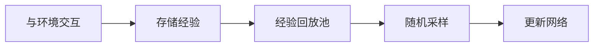

---
tags:
  - #model-free
  - #value-based
  - #off-policy
  - #online-rl
  - #discrete
  - #function-approximation
---

# DQN (Deep Q-Network)

> 深度Q网络：将Q-Learning与深度学习结合的开创性算法

---

## 🏷️ 分类属性

| 维度 | 分类 |
|:---|:---|
| **模型依赖** | [[01-分类维度/Model-Free|无模型]] |
| **优化对象** | [[01-分类维度/Value-Based-Methods|基于价值]] |
| **策略类型** | [[01-分类维度/Off-Policy|离策略]] |
| **数据来源** | [[01-分类维度/Online-RL|在线学习]] |
| **动作空间** | [[01-分类维度/Discrete-Actions|离散动作]] |
| **学习范式** | [[01-分类维度/Function-Approximation|函数逼近]] |

---

## 🔗 知识图谱链接

### 上位概念
- [[Q-Learning]] - DQN的基础算法
- [[01-分类维度/Value-Based-Methods]] - 所属类别
- [[Model-Free]] - 所属类别

### 相关算法
- [[DDQN]] - Double DQN（改进版）
- [[CQL]] - Conservative Q-Learning（离线版本）

### 核心组件
- [[经验回放]] - Off-Policy的核心机制
- [[目标网络]] - 稳定训练的关键技巧
- [[Bellman方程和TD误差]] - 理论基础

### 应用场景
- [[Discrete-Actions]] - 适用于离散动作空间
- Atari游戏、棋类游戏等

---

## 📚 算法概述

DQN（Deep Q-Network）是由DeepMind在2015年提出，首次将深度学习成功应用于强化学习，在Atari游戏上达到人类水平。

### 核心思想
将Q-Learning中的Q表替换为神经网络，用函数逼近解决状态空间过大的问题。

$$Q(s, a; \theta) \approx Q^*(s, a)$$

### 关键创新
1. **经验回放 (Experience Replay)** - 打破数据相关性
2. **目标网络 (Target Network)** - 稳定训练目标

---

## 🧮 算法详解

### Q-Learning基础

DQN基于Q-Learning的更新规则：

$$Q(s, a) \leftarrow Q(s, a) + \alpha \cdot [r + \gamma \cdot \max_{a'} Q(s', a') - Q(s, a)]$$

在DQN中，用神经网络近似Q函数：

$$L(\theta) = \mathbb{E}[(y - Q(s, a; \theta))^2]$$

其中：
$$y = r + \gamma \cdot \max_{a'} Q(s', a'; \theta^{-})$$

$\theta^{-}$ 是目标网络的参数（定期从主网络复制）

---

### 经验回放机制



**好处**：
1. **数据复用**：一次交互可以多次学习
2. **打破相关性**：随机采样使数据更独立
3. **实现Off-Policy**：学习策略≠数据生成策略

---

### 目标网络

**问题**：用同一个网络计算目标和预测，导致"追逐移动靶"的不稳定性。

**解决**：
- 主网络 $Q(s, a; \theta)$ - 实时更新
- 目标网络 $Q(s, a; \theta^{-})$ - 定期同步

**效果**：训练目标在短期内固定，学习更稳定。

---

## ⚠️ 高估问题

### Maximization Bias

DQN使用max操作会系统性高估Q值：

$$\mathbb{E}[\max_a Q(s', a)] \geq \max_a \mathbb{E}[Q(s', a)]$$

**原因**：max总是选择被正向误差"眷顾"的动作

**后果**：
- Q值螺旋上升
- 导致次优策略

### 解决方法

#### 1. 目标网络
部分缓解（不是根本解决）

#### 2. Double DQN (DDQN)
分离"选择动作"和"评估动作"：

$$y = r + \gamma \cdot Q(s', \arg\max_{a'} Q(s', a'; \theta); \theta^{-})$$

- 主网络负责选动作
- 目标网络负责评估
- 大大缓解高估问题

---

## 📊 算法流程

```
初始化：主网络 Q(θ)，目标网络 Q(θ⁻)，经验池 D

对于每个episode：
    初始化状态 s

    对于每个步骤：
        1. 用ε-greedy选择动作 a
        2. 执行 a，观察 r, s'
        3. 存储 (s, a, r, s') 到经验池 D
        4. 从 D 随机采样一批经验
        5. 计算目标：y = r + γ·max Q(s', a'; θ⁻)
        6. 更新主网络：最小化 (y - Q(s, a; θ))²
        7. 每C步同步：θ⁻ ← θ
```

---

## 💡 优缺点分析

### 优点
- ✅ 解决状态空间过大问题
- ✅ 端到端学习（从原始像素到动作）
- ✅ 经验回放提高样本效率
- ✅ 可以处理复杂环境（如图像）

### 缺点
- ❌ 只能处理离散动作
- ❌ Q值高估问题
- ❌ 训练不稳定
- ❌ 超参数敏感

---

## 🎯 应用场景

### 适合
- ✅ Atari游戏
- ✅ 棋类游戏（围棋、国际象棋）
- ✅ 任何离散动作空间问题

### 不适合
- ❌ 连续控制问题（用DDPG/SAC/PPO）
- ❌ 需要高频交互的场景

---

## 📈 性能表现

在Atari 2600游戏上：
- 超过人类专家水平
- 部分游戏达到超级人类水平
- 证明了深度强化学习的潜力

---

## 🔄 算法演进

```
Q-Learning (表格)
    ↓
DQN (神经网络)
    ↓
DDQN (解决高估)
    ↓
Dueling DQN (网络结构改进)
    ↓
Rainbow DQN (多项改进集成)
    ↓
CQL (离线版本)
```

---

## 📝 代码片段

```python
# DQN网络结构
class DQN(nn.Module):
    def __init__(self, state_dim, action_dim):
        super().__init__()
        self.network = nn.Sequential(
            nn.Linear(state_dim, 128),
            nn.ReLU(),
            nn.Linear(128, 128),
            nn.ReLU(),
            nn.Linear(128, action_dim)
        )

    def forward(self, x):
        return self.network(x)

# 计算损失
def compute_loss(batch, main_net, target_net, gamma):
    states, actions, rewards, next_states, dones = batch

    # 当前Q值
    current_q = main_net(states).gather(1, actions)

    # 目标Q值
    with torch.no_grad():
        next_q = target_net(next_states).max(1)[0]
        target_q = rewards + gamma * next_q * (1 - dones)

    # Huber损失
    loss = F.smooth_l1_loss(current_q, target_q.unsqueeze(1))
    return loss
```

---

## ⚠️ 高估问题与 Double DQN

### 高估问题（Maximization Bias）

`max` 操作天生就是"乐观的"。Q网络因为是近似估计，输出值总会有随机误差（噪声）。

**比喻："过于自信的招聘经理"**

假设招聘经理（Q网络）要评估3个候选人（3个动作），真实能力都是5分，但经理评估有误差，给出 {4.8, 5.2, 4.9}：
- **标准DQN**：执行 `max` 操作，选出5.2分，认为岗位价值就是5.2分
- **问题**：`max` 总是选择被正向误差"眷顾"的动作，系统性高估真实价值

### Double DQN 的解决方案

Double DQN 引入**分权制衡**，将"挑选动作"和"评估动作"分开：

1. **角色分工**：
   - **主网络 `Q_θ`**：动作挑选官，找出Q值最高的动作
   - **目标网络 `Q_{θ'}`**：价值评估官，对选出的动作独立评估

2. **新更新公式**：
   $$y = r + γ \cdot Q_{θ'}(s', \text{argmax}_{a'} Q_θ(s', a'))$$

   - 第一步（挑选）：$a^* = \text{argmax}_{a'} Q_θ(s', a')$ — 主网络选出最佳动作
   - 第二步（评估）：$Q_{θ'}(s', a^*)$ — 目标网络独立评估该动作价值

**效果**：动作必须同时被主网络认为"最好"且被目标网络给出高分，才算真的高价值。两个独立网络都被同一正向误差"眷顾"的概率远小于单个网络，大大缓解了最大化偏差。

---

## 📖 参考资源

- 论文：Mnih et al. "Human-level control through deep reinforcement learning" (Nature 2015)
- 代码实现：[各种开源实现]
- 相关教程：[链接到教程]

---

## 🏷️ 相关Tags

`#model-free` `#value-based` `#off-policy` `#online-rl` `#discrete` `#function-approximation`
