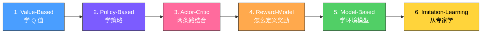

---
tags:
  - module
  - index
  - learning-path
created: 2026-06-23
---

# 02-模块层：完整算法学习路径

> 6 个子模块，从简单到复杂，从经典到前沿。按顺序学，每个模块都建立在前一个模块的基础上。

---

## 学习顺序总览



**为什么这个顺序？**

1. **Value-Based** 最直观：给每个动作打分，选最高分。离散动作、小状态空间。
2. **Policy-Based** 解决 Value-Based 的局限：连续动作、随机策略、端到端优化。
3. **Actor-Critic** 是两条路的结合：用 Critic（价值）指导 Actor（策略），取长补短。
4. **Reward-Model** 回答"奖励从哪来"：人类偏好、可验证规则、自我奖励。这是 LLM 对齐的核心。
5. **Model-Based** 换思路：不直接学策略，先学环境模型，用模型"脑补"经验。样本效率高。
6. **Imitation-Learning** 最后：不从奖励学，直接从专家示范学。逆向强化学习、知识蒸馏。

---

## 1. Value-Based（价值学习）

**核心思想**：学一个 Q 函数，给每个 (状态, 动作) 对打分，选最高分。

**适合**：离散动作空间（上下左右、选哪个物品）。

**不适合**：连续动作空间（力的大小、角度）。

### 学习顺序

| 顺序 | 算法 | 年份 | 一句话 | 解决了什么问题 | 依赖的原子 |
|:----:|------|:----:|--------|---------------|-----------|
| 1 | [[02-模块/Value-Based/Q-Learning]] | 1989 | 表格型 Q 学习 | 最基础的 off-policy 方法 | [[01-原子/Bellman方程]] |
| 2 | [[02-模块/Value-Based/SARSA]] | 1994 | 表格型 on-policy | 对比 Q-Learning，理解 on/off-policy 差异 | [[01-原子/TD误差]] |
| 3 | [[02-模块/Value-Based/DQN]] | 2015 | 深度 Q 网络 | 用神经网络拟合 Q，处理高维状态 | [[01-原子/经验回放]]、[[01-原子/目标网络]] |
| 4 | [[02-模块/Value-Based/DDQN]] | 2016 | Double DQN | 解决 DQN 的 overestimation 问题 | [[01-原子/目标网络]] |
| 5 | [[02-模块/Value-Based/BCQ]] | 2018 | Batch-Constrained Q-learning | Offline RL，限制动作在数据集分布内 | [[01-原子/重参数化技巧]] |
| 6 | [[02-模块/Value-Based/CQL]] | 2020 | Conservative Q-Learning | Offline RL，防止 OOD 动作的 Q 值过高 | [[01-原子/KL散度]] |
| 7 | [[02-模块/Value-Based/IQL]] | 2022 | Implicit Q-Learning | Offline RL，完全避免 OOD 动作 | [[01-原子/优势函数]] |

**关键洞察**：Q-Learning → DQN 是"从表格到神经网络"，CQL/BCQ/IQL 是"从 online 到 offline"。

---

## 2. Policy-Based（策略学习）

**核心思想**：直接学策略 $\pi_\theta(a|s)$，不经过 Q 值。

**适合**：连续动作空间、随机策略、高维动作。

**为什么需要？** Value-Based 在连续动作上要枚举无穷多个动作取 argmax，做不到。Policy-Based 直接输出动作分布。

### 学习顺序

| 顺序 | 算法 | 年份 | 一句话 | 解决了什么问题 | 依赖的原子 |
|:----:|------|:----:|--------|---------------|-----------|
| 1 | [[02-模块/Policy-Based/REINFORCE]] | 1992 | 经典策略梯度 | 最基础的 policy gradient，用 MC 估计回报 | [[01-原子/策略梯度]] |
| 2 | [[02-模块/Policy-Based/Policy-Gradient]] | — | 策略梯度理论 | 深入理解 $\nabla J$ 的推导和估计方法 | [[01-原子/优势函数]]、[[01-原子/GAE]] |
| 3 | [[02-模块/Policy-Based/TRPO]] | 2015 | 信赖域策略优化 | 限制策略更新幅度，保证单调改进 | [[01-原子/Trust-Region]]、[[01-原子/KL散度]] |
| 4 | [[02-模块/Policy-Based/PPO]] | 2017 | 近端策略优化 | TRPO 的简化版，用 clip 替代 KL 约束 | [[01-原子/Clip机制]]、[[01-原子/重要性采样]] |
| 5 | [[02-模块/Policy-Based/GRPO]] | 2024 | Group Relative Policy Optimization | 去掉 Critic，用组内相对奖励（DeepSeek） | [[01-原子/优势函数]] |
| 6 | [[02-模块/Policy-Based/DAPO]] | 2024 | Decoupled Alignment Preference Optimization | 解耦 clip，解决 LLM 推理训练的熵坍缩 | [[01-原子/Clip机制]] |

**关键洞察**：REINFORCE 方差大 → TRPO 用 KL 约束稳定训练 → PPO 用 clip 简化 TRPO。

---

## 3. Actor-Critic（演员-评论家）

**核心思想**：Actor 选动作（Policy-Based），Critic 评价（Value-Based）。用 Critic 的低方差指导 Actor 的高方差。

**为什么需要？** 纯 Policy-Based 用 MC 估计回报，方差大。Critic 提供即时的、低方差的评价。

### 学习顺序

| 顺序 | 算法 | 年份 | 一句话 | 解决了什么问题 | 依赖的原子 |
|:----:|------|:----:|--------|---------------|-----------|
| 1 | [[02-模块/Actor-Critic/A3C]] | 2016 | Asynchronous Advantage Actor-Critic | 异步多进程训练，加速收敛 | [[01-原子/策略梯度]] |
| 2 | [[02-模块/Actor-Critic/A2C]] | 2016 | Advantage Actor-Critic | A3C 的同步简化版，实践中更稳定 | [[01-原子/优势函数]] |
| 3 | [[02-模块/Actor-Critic/DDPG]] | 2016 | Deep Deterministic Policy Gradient | 连续动作空间的 Actor-Critic | [[01-原子/重参数化技巧]] |
| 4 | [[02-模块/Actor-Critic/TD3]] | 2018 | Twin Delayed DDPG | 解决 DDPG 的 overestimation，双 Critic + 延迟更新 | [[01-原子/目标网络]] |
| 5 | [[02-模块/Actor-Critic/SAC]] | 2018 | Soft Actor-Critic | 最大熵 RL，鼓励探索，连续动作 SOTA | [[01-原子/最大熵原理]]、[[01-原子/重参数化技巧]] |
| 6 | [[02-模块/Actor-Critic/AWAC]] | 2020 | Advantage-Weighted Actor-Critic | Offline-to-online 微调 | [[01-原子/重要性采样]] |

**关键洞察**：A2C/A3C 是离散动作 → DDPG/TD3 扩展到连续动作 → SAC 加最大熵鼓励探索 → AWAC 处理 offline-to-online。

---

## 4. Reward-Model（奖励建模）

**核心思想**：前面的方法都假设"奖励函数已知"。但现实中，奖励从哪来？这个模块回答这个问题。

**为什么重要？** LLM 对齐（RLHF、DPO）的核心就是奖励建模。

### 学习顺序

| 顺序 | 算法 | 年份 | 一句话 | 解决了什么问题 | 依赖的原子 |
|:----:|------|:----:|--------|---------------|-----------|
| 1 | [[02-模块/Reward-Model/Pointwise-RM]] | 2020 | 逐点奖励模型 | 直接回归标量分数，能学到绝对值 | [[01-原子/Reward-Model训练方法]] |
| 2 | [[02-模块/Reward-Model/Pairwise-RM]] | 2022 | 成对奖励模型 | 通过比较训练，InstructGPT 的做法 | [[01-原子/Bradley-Terry模型]] |
| 3 | [[02-模块/Reward-Model/ORM]] | 2023 | Outcome Reward Model | 只看最终结果打分，简单但有 credit assignment 问题 | [[01-原子/信用分配]] |
| 4 | [[02-模块/Reward-Model/PRM]] | 2023 | Process Reward Model | 给推理过程的每一步打分，密集奖励 | [[01-原子/优势函数]] |
| 5 | [[02-模块/Reward-Model/DPO]] | 2023 | Direct Preference Optimization | 跳过 RM，直接用偏好数据优化策略 | [[01-原子/KL散度]] |
| 6 | [[02-模块/Reward-Model/Verifiable-Reward]] | 2024 | 可验证奖励 | 规则验证（数学、代码），不需要训练 | — |
| 7 | [[02-模块/Reward-Model/LLM-as-Judge]] | 2024 | LLM 作为评判器 | 用强 LLM 打分，零训练成本 | — |
| 8 | [[02-模块/Reward-Model/Generative-RM]] | 2024 | 生成式奖励模型 | 先生成理由再打分，可解释性强 | — |
| 9 | [[02-模块/Reward-Model/Self-Rewarding]] | 2024 | 自我奖励 | 模型自己给自己打分，减少人工标注 | — |

**关键洞察**：Pointwise/Pairwise 是经典 RM → ORM/PRM 是"结果 vs 过程" → DPO 跳过 RM → Verifiable/LLM-as-Judge 是不需要训练的替代方案 → Self-Rewarding 是模型自我改进。

---

## 5. Model-Based（模型学习）

**核心思想**：不直接学策略，先学环境模型 $P(s'|s,a)$，用模型"脑补"经验，提高样本效率。

**为什么需要？** Model-Free 方法（前面所有方法）每个经验都要真实交互。如果交互成本高（真实机器人、医疗），Model-Based 可以用少量真实数据学模型，然后用模型生成大量虚拟经验。

### 学习顺序

| 顺序 | 算法 | 年份 | 一句话 | 解决了什么问题 | 依赖的原子 |
|:----:|------|:----:|--------|---------------|-----------|
| 1 | [[02-模块/Model-Based/Dyna-Q]] | 1991 | 动态规划 + Q-Learning | 最基础的 Model-Based，学模型 + 用模型规划 | [[01-原子/Bellman方程]] |
| 2 | [[02-模块/Model-Based/PETS]] | 2018 | Probabilistic Ensemble Trajectory Sampling | 用概率集成模型量化不确定性，用 CEM 规划 | [[01-原子/策略梯度]] |
| 3 | [[02-模块/Model-Based/MBPO]] | 2019 | Model-Based Policy Optimization | 学模型 + 用模型训练策略，理论保证 | [[01-原子/策略梯度]] |

**关键洞察**：Dyna-Q 是"学模型 + 用模型做规划" → PETS 引入概率模型量化不确定性 → MBPO 把模型学习和策略学习解耦。

---

## 6. Imitation-Learning（模仿学习）

**核心思想**：不从奖励学，直接从专家示范学。

**为什么需要？** 有时候奖励函数很难设计（自动驾驶、机器人操作），但有大量专家示范数据。

### 学习顺序

| 顺序 | 算法 | 年份 | 一句话 | 解决了什么问题 | 依赖的原子 |
|:----:|------|:----:|--------|---------------|-----------|
| 1 | [[02-模块/Imitation-Learning/IRL]] | 2000 | Inverse Reinforcement Learning | 从专家示范反推奖励函数 | [[01-原子/Reward-Model训练方法]] |
| 2 | [[02-模块/Imitation-Learning/知识蒸馏]] | 2015 | Knowledge Distillation | 让小模型学习大模型的输出分布 | [[01-原子/KL散度]] |

**关键洞察**：IRL 是"从示范学奖励" → 知识蒸馏是"从大模型学策略"。

---

## 模块间的依赖关系

```
Value-Based ──→ Policy-Based ──→ Actor-Critic
    ↓                ↓                ↓
  Q函数            策略梯度         Actor+Critic
    ↓                ↓                ↓
  离散动作         连续动作         连续+探索
                                     ↓
                              Reward-Model（奖励从哪来）
                                     ↓
                              Model-Based（学环境模型）
                                     ↓
                              Imitation-Learning（从专家学）
```

**每个模块都依赖 01-原子层**：
- Value-Based 依赖 [[01-原子/Bellman方程]]、[[01-原子/TD误差]]
- Policy-Based 依赖 [[01-原子/策略梯度]]、[[01-原子/优势函数]]
- Actor-Critic 依赖两者
- Reward-Model 依赖 [[01-原子/KL散度]]、[[01-原子/Bradley-Terry模型]]
- Model-Based 依赖 [[01-原子/Bellman方程]]
- Imitation-Learning 依赖 [[01-原子/KL散度]]

---

## 演化视角

如果想看这些算法的历史演化脉络，读 [[03-流程/]]：

- [[03-流程/Value-Based演化史]]：Q-Learning → DQN → Rainbow → CQL
- [[03-流程/Policy-AC演化史]]：REINFORCE → TRPO → PPO → SAC → GRPO → DAPO
- [[03-流程/Model-Based演化史]]：Dyna-Q → PETS → MBPO → Dreamer
- [[03-流程/Offline-RL与RLHF演化史]]：BC → CQL → IQL → DPO → GRPO

---

## 下一步

- **想看某个算法的细节** → 点进对应的子目录
- **想看算法间的演化关系** → [[03-流程/]]
- **想看具体应用场景** → [[05-应用领域/]]
