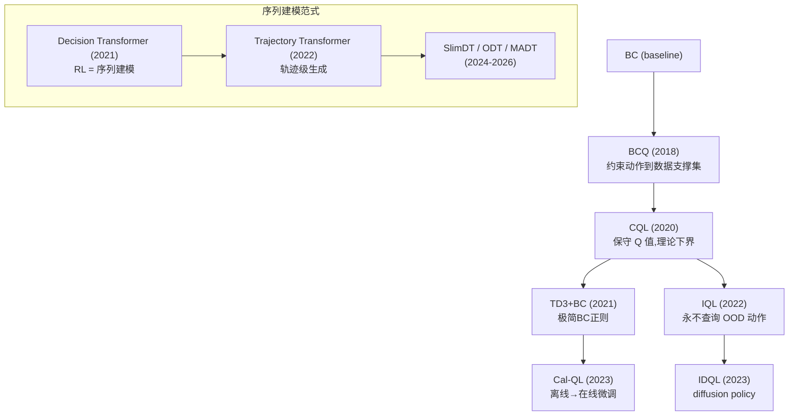
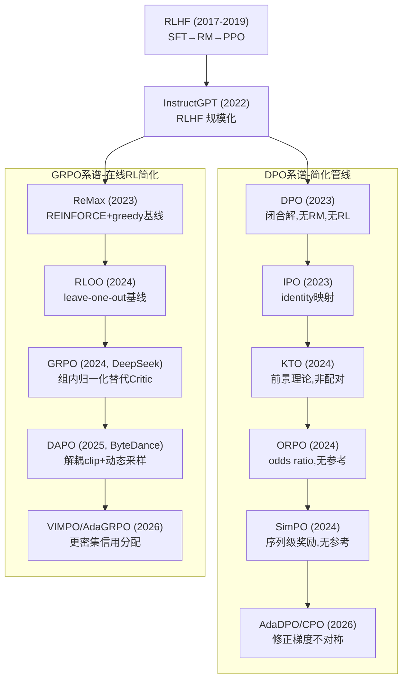

# Offline RL 与 RLHF/偏好优化方法演化全景

> **定位**:从 Behavioral Cloning 到 GRPO/DAPO,完整梳理两大谱系的核心动机、关键公式、优缺点与演化关系。
> **更新**:2026-06-21 | 覆盖到 2025-2026 最新工作

---

## 目录

- [Part A: Offline RL 演化](#part-a-offline-rl-演化)
  - [A1. Behavioral Cloning (BC)](#a1-behavioral-cloning-bc)
  - [A2. BCQ (2018)](#a2-bcq-batch-constrained-deep-q-learning-2018)
  - [A3. CQL (2020)](#a3-cql-conservative-q-learning-2020)
  - [A4. AWAC (2020)](#a4-awac-advantage-weighted-actor-critic-2020)
  - [A5. TD3+BC (2021)](#a5-td3bc-2021)
  - [A6. IQL (2022)](#a6-iql-implicit-q-learning-2022)
  - [A7. Decision Transformer (2021)](#a7-decision-transformer-2021)
  - [A8. Trajectory Transformer (2022)](#a8-trajectory-transformer-2022)
  - [A9. 2023-2026 最新进展](#a9-2023-2026-offline-rl-最新进展)
  - [A10. 离线 RL 演化总结图](#a10-离线-rl-演化总结)
- [Part B: RLHF / 偏好优化演化](#part-b-rlhf--偏好优化演化)
  - [B1. RLHF 原始管线 (2017-2020)](#b1-rlhf-原始管线-2017-2020)
  - [B2. InstructGPT (2022)](#b2-instructgpt-2022)
  - [B3. RLHF-PPO 标准管线](#b3-rlhf-ppo-标准管线)
  - [B4. DPO (2023)](#b4-dpo-direct-preference-optimization-2023)
  - [B5. IPO (2023)](#b5-ipo-identity-preference-optimization-2023)
  - [B6. KTO (2024)](#b6-kto-kahneman-tversky-optimization-2024)
  - [B7. ORPO (2024)](#b7-orpo-odds-ratio-preference-optimization-2024)
  - [B8. SimPO (2024)](#b8-simpo-simple-preference-optimization-2024)
  - [B9. ReMax (2023)](#b9-remax-relax-then-clip-2023)
  - [B10. RLOO (2024)](#b10-rloo-reinforce-leave-one-out-2024)
  - [B11. GRPO (2024)](#b11-grpo-group-relative-policy-optimization-2024)
  - [B12. DAPO (2025)](#b12-dapo-decoupled-clip-and-dynamic-sampling-2025)
  - [B13. 2025-2026 前沿方法](#b13-2025-2026-前沿方法)
  - [B14. RLHF 演化总结图](#b14-rlhf-演化总结)
- [专题深度讨论](#专题深度讨论)
- [参考文献](#参考文献)

---

## Part A: Offline RL 演化

### 核心问题

Offline RL (离线强化学习/批量 RL) 的根本挑战是 **分布偏移 (distribution shift)**:智能体学到的策略 (learned policy) 在推理时可能采取数据集中从未出现的动作,此时 Q 函数对这些 **OOD (out-of-distribution) 动作**的值估计极不可靠,而策略优化会倾向于选择被高估的动作,形成恶性循环。

所有 Offline RL 方法的本质都是在回答同一个问题:**如何在不查询 OOD 动作的前提下,从静态数据集中提取出超越行为策略的策略?**

---

### A1. Behavioral Cloning (BC)

**来源与动机**:最古老的模仿学习方法,直接将专家数据当作监督学习样本。

**核心创新**:不涉及 RL,纯粹将策略学习视为条件概率拟合 $\pi(a|s) \approx \pi_{\text{expert}}(a|s)$。

**关键公式**:
$$\mathcal{L}_{\text{BC}} = \mathbb{E}_{(s,a) \sim \mathcal{D}} \left[ -\log \pi_\theta(a|s) \right]$$

**优缺点**:
- 优点:实现极简,稳定,不需要奖励函数
- 缺点:
  - **复合误差 (compounding error)**:推理时一旦偏离训练轨迹,误差会累积放大 (Ross et al., 2011)
  - 只能达到行为策略的水平,无法超越
  - 对数据质量极度敏感

**演化位置**:Offline RL 的"下界 baseline"——所有真正的 Offline RL 方法都应该超越 BC。

---

### A2. BCQ: Batch-Constrained Deep Q-Learning (2018)

**来源**:`Fujimoto, Meger, Precup, "Off-Policy Deep Reinforcement Learning without Exploration", ICML 2019` (arXiv:1812.02900)

**解决的先前问题**:标准 off-policy RL (DQN/DDPG) 在固定 batch 上因 **外推误差 (extrapolation error)** 而完全失败——Q 函数对数据集中未出现的 (s,a) 对产生严重的过高估计。

**核心创新**:**约束动作空间到数据集支撑集 (support) 附近**。具体做法是训练一个 VAE 来建模数据集中的动作分布,在策略优化时只考虑 VAE 能生成的动作。

**关键公式**:
$$\pi(s) = \arg\max_{a_i \sim G_\omega(s)} Q_\theta(s, a_i)$$

其中 $G_\omega$ 是生成模型 (VAE),只生成数据集中出现过的动作类型。策略不是自由优化,而是从生成模型的候选中选最优。

**优缺点**:
- 优点:第一个成功实现连续控制离线深度 RL 的方法;从根本上避免了 OOD 动作查询
- 缺点:
  - VAE 训练不稳定,生成质量受限
  - 动作候选离散化导致精度损失
  - 对数据集覆盖度要求高

**演化位置**:开创了 **"约束动作到数据集支撑集"** 这一离线 RL 范式,直接启发了后续的 CQL、TD3+BC 等方法。

---

### A3. CQL: Conservative Q-Learning (2020)

**来源**:`Kumar, Zhou, Tucker, Levine, "Conservative Q-Learning for Offline Reinforcement Learning", NeurIPS 2020` (arXiv:2006.04779)

**解决的先前问题**:BCQ 的 VAE 约束复杂且不够灵活。能否通过一个简单的正则化项来系统性地解决 OOD Q 值高估?

**核心创新**:**让 Q 函数保守化——对当前策略的 Q 值给出下界估计**。在 Bellman 误差的基础上加一个正则项,压低 OOD 动作的 Q 值,同时推高数据内动作的 Q 值。

**关键公式**:
$$\min_Q \; \alpha \cdot \underbrace{\left( \mathbb{E}_{s \sim \mathcal{D}} \left[ \log \sum_a \exp Q(s,a) \right] - \mathbb{E}_{(s,a) \sim \mathcal{D}} [Q(s,a)] \right)}_{\text{保守正则项}} + \frac{1}{2} \mathbb{E}_{(s,a,r,s') \sim \mathcal{D}} \left[ (Q(s,a) - \hat{\mathcal{B}}^\pi Q(s,a))^2 \right]$$

第一项压低所有动作的 Q 值 (尤其是 OOD 的,因为它们的 Q 值最高所以被压得最多),第二项维持数据内动作的 Q 值准确。效果是 $\mathbb{E}_\pi[Q] \leq V^\pi$ (Q 值下界保证)。

**优缺点**:
- 优点:
  - 理论保证:策略价值的下界
  - 实现简单:在标准 DQN/SAC 上加一行正则化
  - 在 D4RL 上大幅超越 BCQ 和 BC
- 缺点:
  - **过度保守 (over-conservatism)**:可能过度压低 Q 值,导致过于谨慎的策略
  - 正则项的 log-sum-exp 在连续动作空间需要近似
  - 超参数 $\alpha$ 对性能敏感

**演化位置**:离线 RL 的里程碑方法。"保守估计"思想影响了后续几乎所有 value-based 离线 RL 方法。Cal-QL (Nakamoto et al., 2023) 解决 CQL 在线微调时表现差的问题,通过校准 Q 值尺度实现离线预训练+在线微调的无缝衔接。

---

### A4. AWAC: Advantage-Weighted Actor-Critic (2020)

**来源**:`Nair, Dalal, Gupta, Levine, "Accelerating Online Reinforcement Learning with Offline Datasets", 2020` (arXiv:2011.09199)

**解决的先前问题**:纯离线方法难以在线微调。能否设计一个方法,既利用离线数据,又能在在线交互中持续改进?

**核心创新**:**用优势函数加权的行为克隆来更新策略,避免策略查询 OOD 动作**。策略更新类似加权 BC,权重由 Q 函数的优势值决定。

**关键公式**:
$$\mathcal{L}_\pi = -\mathbb{E}_{(s,a) \sim \mathcal{D}} \left[ \exp\left(\frac{A(s,a)}{\lambda}\right) \log \pi_\theta(a|s) \right]$$

其中 $A(s,a) = Q(s,a) - V(s)$ 是优势函数。好的动作 ($A > 0$) 被指数加权放大,差的动作被抑制。

**优缺点**:
- 优点:
  - 天然支持离线→在线微调 (off-policy critic 持续更新)
  - 策略更新永远不会查询 OOD 动作
  - 与 BC 的联系清晰 ($A=0$ 时退化为 BC)
- 缺点:
  - 仍然需要训练 critic,面临分布偏移
  - 优势函数的尺度选择影响训练

**演化位置**:是 **"优势加权行为克隆"** 这一思想的早期代表,直接影响了 IQL 的策略提取步骤和后续 AWAC-style 的离线-在线混合方法。

---

### A5. TD3+BC (2021)

**来源**:`Fujimoto, Gu, "A Minimalist Approach to Offline Reinforcement Learning", NeurIPS 2021` (arXiv:2106.06860)

**解决的先前问题**:CQL 等方法越来越复杂,能否用极简方法达到同等效果?

**核心创新**:在 TD3 的策略损失上加一个简单的 BC 正则化项,不需要任何复杂的保守 Q 值估计。

**关键公式**:
$$\mathcal{L}_\pi = -\mathbb{E}_{s \sim \mathcal{D}} \left[ Q_\theta(s, \pi_\theta(s)) \right] + \alpha \cdot \mathbb{E}_{(s,a) \sim \mathcal{D}} \left[ (\pi_\theta(s) - a)^2 \right]$$

第一项是标准策略梯度 (最大化 Q 值),第二项是 BC 正则 (策略不要偏离数据太远)。$\alpha$ 平衡探索与保守。

**优缺点**:
- 优点:
  - **极简**:代码改动量极小 (几行)
  - 性能好:在 D4RL 上接近 CQL
  - 训练稳定
- 缺点:
  - BC 正则过于粗糙,无法区分哪些偏离是有益的
  - 超参数 $\alpha$ 的选择依赖数据集质量
  - 没有理论下界保证

**演化位置**:证明了"简单方法 + 正确的正则化"可以与复杂方法竞争。对"算法复杂度 vs 实际效果"的反思影响了整个领域。

---

### A6. IQL: Implicit Q-Learning (2022)

**来源**:`Kostrikov, Nair, Levine, "Offline Reinforcement Learning with Implicit Q-Learning", ICLR 2022` (arXiv:2110.06169)

**解决的先前问题**:CQL 和 TD3+BC 仍然需要在策略优化时查询 $Q(s, \pi(s))$,当 $\pi(s)$ 偏离数据分布时,Q 值不可靠。**能否完全不查询 OOD 动作的 Q 值?**

**核心创新**:**通过 expectile 回归隐式地学习最优动作的价值,而不需要显式地知道最优动作是什么**。关键洞察:把状态价值 $V(s)$ 当作随机变量,其随机性来自数据集中不同动作的 Q 值;取上 expectile (接近 max) 就是在不指定具体动作的情况下估计"数据中最好的动作值多少"。

**关键公式 (三步)**:

**第一步** — 用 expectile 回归学 $V(s)$:
$$\mathcal{L}_V = \mathbb{E}_{(s,a) \sim \mathcal{D}} \left[ L_2^\tau (Q(s,a) - V(s)) \right]$$
其中 $L_2^\tau(u) = |\tau - \mathbf{1}(u < 0)| \cdot u^2$。$\tau > 0.5$ 时 $V(s)$ 偏大,接近 $\max_a Q(s,a)$ 但不需要知道是哪个 $a$。

**第二步** — 用 $V(s)$ 回溯更新 $Q(s,a)$:
$$\mathcal{L}_Q = \mathbb{E}_{(s,a,r,s') \sim \mathcal{D}} \left[ (Q(s,a) - r - \gamma V(s'))^2 \right]$$
注意 Bellman 目标用的是 $V(s')$,不是 $\max_{a'} Q(s',a')$,所以完全不需要查询 OOD 动作。

**第三步** — 用优势加权 BC 提取策略:
$$\mathcal{L}_\pi = -\mathbb{E}_{(s,a) \sim \mathcal{D}} \left[ \exp(\beta (Q(s,a) - V(s))) \log \pi_\theta(a|s) \right]$$

**优缺点**:
- 优点:
  - **彻底避免 OOD 查询**:整个训练过程 Q 函数只在数据内的 (s,a) 上被查询
  - D4RL 上达到 SOTA
  - 理论上与优势加权 BC 联系清晰
  - 在线微调表现也好 (IDQL 进一步用 diffusion policy 提取策略)
- 缺点:
  - expectile 超参数 $\tau$ 需要调优
  - 策略提取用 Gaussian AWAC 可能不够表达多模态分布 (IDQL 的 motivation)
  - 对数据集质量仍敏感

**演化位置**:离线 RL "不查询 OOD 动作" 思路的终极实现。IQL 的 expectile value 思想后来被广泛用于 Decision Transformer 的 reward relabeling (如 EDT4Rec) 和各种离线-在线混合方法。

---

### A7. Decision Transformer (2021)

**来源**:`Chen, Lu, Rajeswaran, Lee, Grover, Laskin, Abbeel, Srinivas, Mordatch, "Decision Transformer: Reinforcement Learning via Sequence Modeling", NeurIPS 2021` (arXiv:2106.01345)

**解决的先前问题**:传统 Offline RL 方法 (CQL/IQL 等) 基于 Bellman 方程和值函数估计,复杂且不稳定。**能否完全抛弃 RL 范式,把 RL 当成语言建模?**

**核心创新 (范式转移)**:**把 RL 重新定义为条件序列建模问题**。不再学 Q 函数或策略梯度,而是训练一个 Transformer,给定"期望回报 (return-to-go)",自回归地生成动作序列。

> **"告诉我你想要多少回报,我给你生成能达到那个回报的动作序列。"**

**关键公式 (架构)**:
输入序列:
$$\hat{R}_1, s_1, a_1, \hat{R}_2, s_2, a_2, \ldots, \hat{R}_T, s_T$$

其中 $\hat{R}_t = \sum_{t'=t}^{T} r_{t'}$ 是从时刻 $t$ 开始的剩余回报 (return-to-go)。

模型预测:
$$a_t = \text{DT}(\hat{R}_t, s_t, \hat{R}_{t-1}, s_{t-1}, a_{t-1}, \ldots)$$

训练:
$$\mathcal{L} = \mathbb{E} \left[ \| a_t - \hat{a}_t \|^2 \right] \quad \text{(连续动作)} \quad \text{或} \quad \mathcal{L} = \mathbb{E} \left[ -\log P(a_t | \ldots) \right] \quad \text{(离散动作)}$$

推理时:设定期望回报 (如最大值),模型自回归生成动作。

**优缺点**:
- 优点:
  - **范式突破**:RL = 条件语言建模,可以利用 Transformer 的 scaling 特性
  - 实现简单,训练稳定 (标准交叉熵/MSE loss)
  - 天然支持多任务和条件控制
  - 在 Atari/Gym 上匹配或超过 CQL/IQL
- 缺点:
  - **不支持轨迹拼接 (trajectory stitching)**:无法像 value-based 方法那样组合不同轨迹的最优片段
  - 性能上限受限于训练数据中的最大回报
  - 对 return-to-go 的标定敏感
  - 连续控制上不如 IQL

**演化位置**:开创了 **"RL as sequence modeling"** 范式。后续工作包括:
- **Online Decision Transformer (ODT)**:通过在线交互微调
- **Prompt DT**:用 prompt 实现多任务泛化
- **SlimDT (2026)**:将 RTG 从自回归序列中移除,注入到状态表征,减少 1/3 序列长度
- **SeDT (2026)**:用 return-to-go 条件化解决多轮对话可靠性问题
- **MADT (2026)**:多智能体 Decision Transformer + 图注意力

---

### A8. Trajectory Transformer (2022)

**来源**:`Janner, Li, Levine, "Offline Reinforcement Learning as One Sequence Modeling Problem", 2022`

**解决的先前问题**:Decision Transformer 将 RTG 作为条件,但没有充分利用轨迹级别的建模能力。能否把整条轨迹当作一个序列来建模?

**核心创新**:将轨迹 $\tau = (s_1, a_1, r_1, s_2, a_2, r_2, \ldots)$ 整体 tokenize,用 GPT 式 Transformer 建模轨迹的概率分布 $P(\tau)$。推理时通过 **beam search** 在高回报轨迹空间中搜索。

**关键公式**:
$$P(\tau) = \prod_t P(s_t, a_t, r_t | s_{<t}, a_{<t}, r_{<t})$$

推理:
$$\tau^* = \arg\max_{\tau: R(\tau) \geq R_{\text{target}}} P(\tau)$$

**优缺点**:
- 优点:
  - 轨迹级建模,可以捕捉长期依赖
  - beam search 天然实现"轨迹拼接"
  - 与 Decision Transformer 互补
- 缺点:
  - 序列长度长,计算开销大
  - 离散化 (tokenization) 损失信息
  - 在高维连续控制上效果有限

**演化位置**:序列建模范式中 "轨迹级" 的代表。启发了后续将 RL 与生成模型 (尤其是 diffusion models) 结合的工作。

---

### A9. 2023-2026 Offline RL 最新进展

**关键发展方向**:

1. **Cal-QL (2023, Nakamoto et al.)**:解决 CQL 离线预训练后在线微调效果差的问题。通过让 Q 值 **校准 (calibrated)** ——既是策略价值的下界,又不至于太低——实现离线→在线的平滑过渡。代码改动仅一行。

2. **Diffusion Policy (2023-2024)**:用 diffusion model 建模策略,解决多模态动作分布问题。IDQL (Hansen-Estruch et al., 2023) 将 IQL 与 diffusion policy 结合。

3. **Decision Transformer 变体持续活跃**:
   - **SlimDT (2026)**:将 RTG 条件从自回归序列中解耦,提升效率
   - **E2DT (2026, ICRA)**:经验感知采样 + DT,解决样本效率问题
   - **MADT (2026)**:多智能体 DT + 图注意力,用于交通协调
   - **Expectile regression 用于 DT 的 reward relabeling**:EDT4Rec 等

4. **深度生成模型 + 离线 RL 综述 (2024)**:Chen et al. (arXiv:2402.13777) 系统综述了 VAE/GAN/Normalizing Flow/Transformer/Diffusion Model 在离线 RL 和模仿学习中的应用。

5. **离线 RL 理论基础 (2025)**:Che (arXiv:2508.07746) 提供直觉性教程,讨论了什么条件下离线 RL 可解/不可解。

---

### A10. 离线 RL 演化总结

<!-- mmd-zoom:d1 -->
> 🔍 [缩放查看本图（可平移/缩放）](Offline-RL与RLHF演化史.md.mermaid.html#d1)

**核心演化脉络**:
1. **BC → BCQ**:从模仿到约束动作空间
2. **BCQ → CQL**:从显式约束到隐式保守 Q 值
3. **CQL → IQL**:从保守估计到完全不查 OOD
4. **CQL → TD3+BC**:从复杂到极简
5. **全部 → Decision Transformer**:范式转移,RL = 条件序列建模

---

## Part B: RLHF / 偏好优化演化

### 核心问题

如何让大语言模型 (LLM) 对齐人类偏好?人类偏好难以写成显式奖励函数,但人类可以相对容易地比较两个回答的优劣。所有 RLHF/偏好优化方法的本质都是在回答:**如何高效地将人类偏好信号转化为模型参数更新?**

---

### B1. RLHF 原始管线 (2017-2020)

**来源**:`Christiano et al., "Deep RL from Human Preferences", 2017`; `Ziegler et al., "Fine-Tuning Language Models from Human Preferences", 2019`

**核心创新**:提出完整的三阶段管线:
1. **SFT (Supervised Fine-Tuning)**:用人工标注的高质量数据微调基础模型
2. **Reward Model Training**:让人类比较两个回答的优劣,训练一个奖励模型 $r_\phi(x, y)$
3. **RL Fine-Tuning**:用 PPO 优化策略以最大化奖励模型的分数

**关键公式**:
奖励模型训练 (Bradley-Terry 模型):
$$\mathcal{L}_{\text{RM}} = -\mathbb{E}_{(x, y_w, y_l) \sim \mathcal{D}} \left[ \log \sigma(r_\phi(x, y_w) - r_\phi(x, y_l)) \right]$$

RL 优化目标:
$$\max_\theta \; \mathbb{E}_{x \sim \mathcal{D}, y \sim \pi_\theta(\cdot|x)} \left[ r_\phi(x, y) - \beta \cdot \text{KL}(\pi_\theta(\cdot|x) \| \pi_{\text{ref}}(\cdot|x)) \right]$$

**优缺点**:
- 优点:开创性工作,证明了人类反馈可以指导 RL
- 缺点:
  - 需要训练 4 个模型 (SFT/RM/Policy/Critic)
  - PPO 训练不稳定,超参数多
  - 奖励模型可能不完美,导致 reward hacking

**演化位置**:RLHF 的奠基工作。后续所有方法都在试图简化这个管线或解决其固有问题。

---

### B2. InstructGPT (2022)

**来源**:`Ouyang et al., "Training language models to follow instructions with human feedback", NeurIPS 2022`

**解决的先前问题**:RLHF 管线虽然存在,但在大规模 LLM 上从未成功应用过。如何让 RLHF 在 GPT-3 级别的模型上真正 work?

**核心创新**:工程突破——证明 RLHF 管线可以在 175B 参数的 LLM 上成功运行,大幅提升指令遵循能力。ChatGPT 的技术基础。

**关键发现**:
- 1.3B 参数的 InstructGPT 优于 175B 的原始 GPT-3
- 标注者的一致性 (inter-annotator agreement) 是关键瓶颈
- PPO 训练中 KL 系数 $\beta$ 的选择至关重要

**优缺点**:
- 优点:证明 RLHF 在大规模 LLM 上可行,开创了 LLM 对齐时代
- 缺点:训练成本极高,需要大量人工标注,管线复杂

**演化位置**:RLHF 从学术概念到工业实践的里程碑。所有后续方法 (DPO/GRPO 等) 都以"让 InstructGPT 的管线更简单/更高效"为目标。

---

### B3. RLHF-PPO 标准管线

**标准四模型架构**:

| 模型 | 角色 | 参数量 |
|------|------|--------|
| Actor (Policy) | 生成回答 | 与 LLM 相同 |
| Critic (Value) | 估计状态价值 | 与 LLM 相同 |
| Reward Model | 评估回答质量 | 通常 < LLM |
| Reference | 计算 KL 散度 | 与 SFT 相同 |

**训练流程**:
1. 对每个 prompt $x$,Actor 生成 $y \sim \pi_\theta(\cdot|x)$
2. Reward Model 打分 $r(x,y)$
3. Critic 估计优势 $A(s,a)$
4. PPO clip 更新 Actor:
$$\mathcal{L}_{\text{PPO}} = \mathbb{E} \left[ \min\left( \rho_t A_t, \text{clip}(\rho_t, 1-\epsilon, 1+\epsilon) A_t \right) \right]$$
其中 $\rho_t = \frac{\pi_\theta(a_t|s_t)}{\pi_{\text{old}}(a_t|s_t)}$ 是重要性采样比率

**核心问题**:
- 4 个模型同时驻留 GPU 内存,显存需求巨大
- PPO 对超参数 (clip 范围、KL 系数、学习率) 极度敏感
- 训练不稳定,经常出现 reward hacking 或模式崩塌

**演化位置**:所有后续方法 (ReMax/RLOO/GRPO/DPO 等) 都在试图减少模型数量或简化训练过程。

---

### B4. DPO: Direct Preference Optimization (2023)

**来源**:`Rafailov, Sharma, Mitchell, Ermon, Manning, Finn, "Direct Preference Optimization: Your Language Model is Secretly a Reward Model", NeurIPS 2023` (arXiv:2305.18290)

**解决的先前问题**:RLHF-PPO 需要 4 个模型和复杂的 RL 训练循环。能否完全跳过奖励模型和 RL,直接用偏好数据优化策略?

**核心创新 (理论突破)**:**证明了 RLHF 的目标函数有闭合形式解,且最优策略可以直接用参考策略和奖励函数表示**。将这个关系代入 Bradley-Terry 偏好模型,得到了一个不依赖奖励模型的纯分类损失。

**关键推导**:

从 RLHF 目标出发:
$$\pi^*(y|x) = \frac{1}{Z(x)} \pi_{\text{ref}}(y|x) \exp\left(\frac{r(x,y)}{\beta}\right)$$

反解奖励函数:
$$r(x,y) = \beta \log \frac{\pi_\theta(y|x)}{\pi_{\text{ref}}(y|x)} + \beta \log Z(x)$$

代入 Bradley-Terry 偏好模型,$Z(x)$ 在偏好对中抵消,得到 DPO 损失:
$$\mathcal{L}_{\text{DPO}} = -\mathbb{E}_{(x, y_w, y_l) \sim \mathcal{D}} \left[ \log \sigma\left(\beta \log \frac{\pi_\theta(y_w|x)}{\pi_{\text{ref}}(y_w|x)} - \beta \log \frac{\pi_\theta(y_l|x)}{\pi_{\text{ref}}(y_l|x)}\right) \right]$$

**直觉**:"好的回答在策略下的概率应该比参考模型高,差的回答应该比参考模型低。"

**优缺点**:
- 优点:
  - **极简**:只需 2 个模型 (策略 + 参考),无 RL 循环
  - 训练稳定,实现简单
  - 效果好:在多个任务上匹配或超过 PPO-based RLHF
  - 计算效率显著提升
- 缺点:
  - **离线方法**:受限于偏好数据质量,无法在线探索
  - **长度偏置**:倾向于生成更长的回答 (Park et al., 2024)
  - **reward hacking**:Rafailov et al. (2024) 证明 DPO 也存在 over-optimization
  - **等价性条件**:Yang et al. (2026, arXiv:2605.20834) 证明 DPO 与 RLHF 的等价性是条件的,当最优策略不偏好人类偏好回答时,DPO 优化的是相对优势而非绝对对齐
  - **梯度不对称**:AdaDPO (Chen et al., 2026) 发现 DPO 对差的回答的梯度比对好的回答大,导致模型学会"避免差答案"而非"生成好答案"

**演化位置**:偏好优化的分水岭。DPO 之后的方法可分为:
1. **改进 DPO**:IPO, KTO, ORPO, SimPO, AdaDPO
2. **回归在线 RL**:ReMax, RLOO, GRPO, DAPO

---

### B5. IPO: Identity Preference Optimization (2023)

**来源**:`Azar, Guo, Seznec, Munos, Piot, Valko, "Direct Alignment with Preferences", 2023` (后被 CoPG 论文, Flet-Berliac et al., 2024 引用)

**解决的先前问题**:DPO 依赖 Bradley-Terry 偏好模型,该模型假设偏好是确定性的。但人类偏好有噪声和非传递性。

**核心创新**:用 **恒等映射 (identity)** 替代 Bradley-Terry 模型中的 sigmoid,直接优化偏好概率的对数似然。

**关键公式**:
$$\mathcal{L}_{\text{IPO}} = -\mathbb{E}_{(x, y_w, y_l)} \left[ \log \sigma\left(\log \frac{\pi_\theta(y_w|x)}{\pi_{\text{ref}}(y_w|x)} - \log \frac{\pi_\theta(y_l|x)}{\pi_{\text{ref}}(y_l|x)} - \frac{1}{2\tau}\right) \right]$$

与 DPO 的区别在于引入了 margin $\frac{1}{2\tau}$,其中 $\tau$ 控制偏好的噪声水平。

**优缺点**:
- 优点:理论上更鲁棒地处理偏好噪声
- 缺点:实际效果与 DPO 差异不大,未被广泛采用

**演化位置**:DPO 的理论改进之一,后来被 CoPG (Contrastive Policy Gradient, Flet-Berliac et al., EMNLP 2024) 统一为更一般的 off-policy policy gradient 框架。

---

### B6. KTO: Kahneman-Tversky Optimization (2024)

**来源**:`Ethayarajh, Xu, Muennighoff, Jurafsky, Kiela, "KTO: Model Alignment as Prospect Theoretic Optimization", ICML 2024` (arXiv:2402.01306)

**解决的先前问题**:DPO/IPO 等方法都依赖 **配对偏好数据** $(y_w, y_l)$,但实际中收集配对数据成本高。能否只用 **非配对信号** (一个回答是好/坏的二元标签) 来对齐?

**核心创新**:从 **前景理论 (Prospect Theory)** 出发,定义 **人类感知损失 (Human-Aware Losses, HALOs)**。人类对损失和收益的感知是不对称的 (损失厌恶),KTO 将这种不对称性编码进损失函数。

**关键公式**:
$$\mathcal{L}_{\text{KTO}} = \mathbb{E}_{(x,y) \sim \mathcal{D}} \left[ 1 - \sigma\left(\beta \cdot \left(v(x,y) - v_0(x)\right)\right) \right]$$

其中:
- $v(x,y) = \log \frac{\pi_\theta(y|x)}{\pi_{\text{ref}}(y|x)}$ (对好的回答)
- $v(x,y) = \lambda \cdot \log \frac{\pi_\theta(y|x)}{\pi_{\text{ref}}(y|x)}$ (对坏的回答,$\lambda > 1$ 体现损失厌恶)
- $v_0(x) = \mathbb{E}_{y' \sim \pi_{\text{ref}}} \left[ \log \frac{\pi_\theta(y'|x)}{\pi_{\text{ref}}(y'|x)} \right]$ (参考基线)

**优缺点**:
- 优点:
  - **不需要配对数据**:只需 (prompt, response, good/bad) 三元组
  - 理论上更贴近人类偏好结构
  - 在 1B-30B 规模上匹配或超过 DPO
- 缺点:
  - 超参数 $\lambda$ (损失厌恶系数) 需要调优
  - 需要估计参考模型的期望,计算成本不低
  - 实际使用频率低于 DPO/SimPO

**演化位置**:将认知科学理论引入偏好优化的创新尝试。证明了非配对数据也可以有效对齐。

---

### B7. ORPO: Odds Ratio Preference Optimization (2024)

**来源**:`Hong, Lee, Thorne, "ORPO: Monolithic Preference Optimization without Reference Model", 2024` (arXiv:2403.07691)

**解决的先前问题**:DPO 需要先做 SFT 再做偏好优化 (两阶段),且需要参考模型。能否 **一步到位**,在 SFT 的同时完成偏好对齐,且不需要参考模型?

**核心创新**:用 **比值比 (odds ratio)** 来对比好/坏回答的风格,将其作为 SFT 的辅助损失,实现 **单阶段 (monolithic)** 偏好优化。

**关键公式**:
$$\mathcal{L}_{\text{ORPO}} = \mathcal{L}_{\text{SFT}} + \lambda \cdot \mathcal{L}_{\text{OR}}$$

$$\mathcal{L}_{\text{OR}} = -\mathbb{E}_{(x, y_w, y_l)} \left[ \log \sigma\left(\log \frac{\text{odds}_\theta(y_w|x)}{\text{odds}_\theta(y_l|x)}\right) \right]$$

其中 $\text{odds}_\theta(y|x) = \frac{P_\theta(y|x)}{1 - P_\theta(y|x)}$,实际计算中用 token 级别的平均概率。

**优缺点**:
- 优点:
  - **无参考模型**:省去参考模型的内存和计算
  - **单阶段**:SFT + 偏好优化同时进行
  - 在 Phi-2/Llama-2/Mistral 上效果不错
- 缺点:
  - odds ratio 的理论动机不如 DPO 的闭合解清晰
  - 在大规模模型上的验证不够充分

**演化位置**:**"去参考模型"** 方向的先驱,直接启发了 SimPO。

---

### B8. SimPO: Simple Preference Optimization (2024)

**来源**:`Meng, Xia, Chen, "SimPO: Simple Preference Optimization with a Reference-Free Reward", NeurIPS 2024` (arXiv:2405.14734)

**解决的先前问题**:DPO 需要参考模型,增加内存和计算开销。能否设计一个更简单、更有效的方法?

**核心创新**:用 **序列平均对数概率** 作为隐式奖励,完全不需要参考模型。同时引入 **目标奖励边际 (target reward margin)** 来增强好/坏回答的区分度。

**关键公式**:
$$r_{\text{SimPO}}(x, y) = \frac{1}{|y|} \sum_{i=1}^{|y|} \log \pi_\theta(y_i | x, y_{<i})$$

$$\mathcal{L}_{\text{SimPO}} = -\mathbb{E}_{(x, y_w, y_l)} \left[ \log \sigma\left(\beta \cdot (r_{\text{SimPO}}(x, y_w) - r_{\text{SimPO}}(x, y_l)) - \gamma\right) \right]$$

其中 $\gamma > 0$ 是目标边际,鼓励好回答和坏回答之间有更大的奖励差距。

**优缺点**:
- 优点:
  - **无参考模型**:更\<think\>更省
  - 效果好:在 AlpacaEval 2 上超过 DPO 6.4 点,Arena-Hard 上超过 7.5 点
  - 不增加回答长度 (DPO 的长度偏置被缓解)
  - Gemma-2-9B + SimPO 在 Chatbot Arena 排名 \<10B 模型第一
- 缺点:
  - 隐式奖励 (平均对数概率) 的理论基础不够深
  - 长度归一化可能在某些场景下有害

**演化位置**:**"去参考模型" + "序列级奖励"** 方向的代表作。证明了比 DPO 更简单的方法可以更好。

---

### B9. ReMax: Relax-then-Clip (2023)

**来源**:`Li, Xu, Zhang, Lin, Yu, Sun, Luo, "ReMax: A Simple, Effective, and Efficient Reinforcement Learning Method for Aligning Large Language Models", ICML 2024` (arXiv:2310.10505)

**解决的先前问题**:PPO 在 LLM RLHF 中过于复杂 (4 个模型、多超参数、训练不稳定)。能否用更简单的 RL 方法?

**核心创新**:利用 RLHF 的三个特性 (快速模拟、确定性转移、轨迹级奖励),基于经典 REINFORCE 算法,用 **贪心解码的奖励作为基线 (baseline)** 来减少方差,完全不需要 Critic 模型。

**关键公式**:
$$\nabla_\theta J(\theta) = \mathbb{E}_{y \sim \pi_\theta(\cdot|x)} \left[ (r(x,y) - r(x, \hat{y}_{\text{greedy}})) \nabla_\theta \log \pi_\theta(y|x) \right]$$

其中 $\hat{y}_{\text{greedy}} = \arg\max_y \pi_\theta(y|x)$ 是贪心解码结果,其奖励 $r(x, \hat{y}_{\text{greedy}})$ 作为基线。

**优缺点**:
- 优点:
  - **无 Critic 模型**:省 1/4 显存 (7B 模型节省 46% GPU 内存)
  - 实现简单,去掉 PPO 的 4+ 个超参数
  - Mistral-7B + ReMax: AlpacaEval 94.78% win rate, MT-bench 7.739
- 缺点:
  - 每次需要额外的贪心解码 (计算开销)
  - 基线估计有偏 (贪心不一定代表期望)
  - 方差比 PPO 的 GAE 大

**演化位置**:**"去 Critic"** 方向的先驱,直接启发了 GRPO 和 RLOO 的"用组内统计替代 Critic"的思路。

---

### B10. RLOO: REINFORCE Leave-One-Out (2024)

**来源**:`Ahmadian et al., "Back to Basics: Revisiting REINFORCE Style Optimization for Learning from Human Feedback", 2024`

**解决的先前问题**:ReMax 用贪心解码作基线,但基线有偏。能否用更无偏的基线?

**核心创新**:对每个 prompt 生成 $K$ 个回答,每个回答的基线是 **其余 $K-1$ 个回答的平均奖励** (leave-one-out 基线)。

**关键公式**:
$$\nabla_\theta J(\theta) = \sum_{k=1}^{K} \left[ \left(r(x, y_k) - \frac{1}{K-1} \sum_{j \neq k} r(x, y_j)\right) \nabla_\theta \log \pi_\theta(y_k|x) \right]$$

等价于:
$$= \sum_{k=1}^{K} \left[ \frac{K}{K-1} (r(x, y_k) - \bar{r}) \nabla_\theta \log \pi_\theta(y_k|x) \right]$$

其中 $\bar{r} = \frac{1}{K} \sum_{k=1}^{K} r(x, y_k)$ 是组内平均奖励。

**优缺点**:
- 优点:
  - 基线无偏 (leave-one-out 是期望奖励的无偏估计)
  - 比 ReMax 方差更低
  - 比 PPO 简单得多 (无 Critic)
- 缺点:
  - 需要 $K$ 次采样,计算成本随 $K$ 线性增长
  - 本质上是 GRPO 的理论前身 (GRPO 加了 clip 和其他工程改进)

**演化位置**:RLOO 和 GRPO 的核心思想几乎相同 (组内归一化替代 Critic)。RLOO 更偏理论分析,GRPO 更偏工程实践。

---

### B11. GRPO: Group Relative Policy Optimization (2024)

**来源**:`Shao, Wang, Zhu, Xu, Song, Bi, Zhang, Zhang, Li, Wu, Guo, "DeepSeekMath: Pushing the Limits of Mathematical Reasoning in Open Language Models", 2024` (arXiv:2402.03300)

**解决的先前问题**:PPO 的 Critic 模型占一半内存且训练不稳定。ReMax/RLOO 证明可以去掉 Critic,但缺少 PPO 的 clip 机制来控制策略更新幅度。

**核心创新**:**用组内归一化奖励替代 Critic,同时保留 PPO 的 clip 机制**。对每个 prompt 采样一组 ($G$ 个) 回答,用组内的均值和标准差归一化奖励,作为优势估计。

**关键公式**:

对每个 prompt $x$,采样 $G$ 个回答 $\{y_1, y_2, \ldots, y_G\}$:

**组内归一化优势**:
$$A_i = \frac{r_i - \text{mean}(r_1, \ldots, r_G)}{\text{std}(r_1, \ldots, r_G) + \epsilon}$$

**GRPO 目标** (PPO-style clip + KL 正则):
$$\mathcal{L}_{\text{GRPO}} = -\mathbb{E} \left[ \frac{1}{G} \sum_{i=1}^{G} \frac{1}{|y_i|} \sum_{t=1}^{|y_i|} \left\{ \min\left(\rho_{i,t} A_i, \text{clip}(\rho_{i,t}, 1-\epsilon, 1+\epsilon) A_i\right) - \beta \cdot D_{\text{KL}}(\pi_\theta \| \pi_{\text{ref}}) \right\} \right]$$

其中 $\rho_{i,t} = \frac{\pi_\theta(y_{i,t} | x, y_{i,<t})}{\pi_{\text{old}}(y_{i,t} | x, y_{i,<t})}$ 是 token 级重要性采样比率。

**为什么组内归一化替代了 Critic?**

在标准 actor-critic 中,优势 $A(s,a) = r + \gamma V(s') - V(s)$ 需要 value function $V$。但在 LLM 生成中:
- 状态 $s$ 是已生成的 token 序列
- 一个 prompt 下的多个回答共享相同的初始状态
- 组内平均奖励 $\bar{r}$ 是 $V(s_0)$ 的蒙特卡罗估计
- 组内归一化等价于用 $\bar{r}$ 作为基线,除以标准差做方差缩减

**优缺点**:
- 优点:
  - **无 Critic**:省一半内存
  - 保留了 PPO 的 clip 机制,策略更新可控
  - 在数学推理任务上效果突出 (DeepSeekMath 7B 达到 MATH 51.7%)
  - DeepSeek-R1 的核心训练算法
- 缺点:
  - 组大小 $G$ 越大越稳定但越贵
  - 组内奖励方差小时 (如所有回答都正确或都错误),优势接近零,梯度信号弱
  - Dropout-GRPO (Jung, 2026) 指出在连续潜在推理中,多次 rollout 可能产生相同轨迹

**演化位置**:2024-2025 年 LLM 对齐/推理增强的 **事实标准**。DeepSeek-R1、Qwen-R1 等推理模型都基于 GRPO。后续变体包括:
- **DAPO (2025)**:Decoupled Clip + Dynamic Sampling
- **N-GRPO (2026, ACL Findings)**:Embedding-level neighbor mixing 增强探索
- **AdaGRPO (2026)**:能力感知自适应,用于 flow models
- **BiasGRPO (2026, ACL Findings)**:用 GRPO 减轻 LLM 社会偏见
- **VIMPO (2026)**:policy-implied value function,无 Critic 但提供更密集的信用分配

---

### B12. DAPO: Decoupled Clip and Dynamic Sampling (2025)

**来源**:`Yu, Zhang, Zhu, Yuan, Zuo, Yue, Dai, Fan, Liu, Liu, Liu, Lin, Lin, Ma, Sheng, Tong, Zhang, Zhang, Zhang, Zhu, Zhu, Chen, Chen, Wang, Yu, Song, Wei, Zhou, Liu, Ma, Zhang, Yan, Qiao, Wu, Wang, "DAPO: An Open-Source LLM Reinforcement Learning System at Scale", 2025` (arXiv:2503.14476)

**解决的先前问题**:GRPO 在大规模推理 LLM 训练中仍有问题:
1. Clip 机制对所有 token 一视同仁,但低概率 token 的更新可能有害
2. 采样效率低:很多 prompt 的所有回答都正确/错误,梯度信号为零

**核心创新 (四项关键技术)**:

1. **Decoupled Clip (解耦裁剪)**:
   - 对比率 $\rho_t$ 的上界和下界使用不同的 clip 值
   - 上界 clip = $1+\epsilon$ (限制正向更新)
   - 下界 clip = $1-\epsilon'$ 或完全放开 (允许负向更新更自由)
   - 防止低概率 token 的正向更新过大

2. **Dynamic Sampling (动态采样)**:
   - 过滤掉 "全对" 和 "全错" 的 prompt (这些 prompt 的组内优势全为零,不产生梯度)
   - 动态选择有信息量的 prompt 来训练

3. **Token-level Loss**:
   - 在整个 token 序列上计算 loss,而非序列平均

4. **Overlong Reward Penalty**:
   - 对过长的回答施加额外惩罚,防止模型通过"啰嗦"来提高奖励

**关键公式 (Decoupled Clip)**:
$$\mathcal{L}_{\text{DAPO}} = -\mathbb{E} \left[ \frac{1}{G} \sum_{i=1}^{G} \frac{1}{|y_i|} \sum_{t=1}^{|y_i|} \min\left(\rho_{i,t} A_i, \text{clip}(\rho_{i,t}, 1-\epsilon_{\text{low}}, 1+\epsilon_{\text{high}}) A_i\right) \right]$$

**优缺点**:
- 优点:
  - **完全开源**:代码、数据、训练细节全部公开
  - Qwen2.5-32B + DAPO 在 AIME 2024 达到 50 分
  - 基于 verl 框架,可复现
  - 四项技术的消融实验清晰
- 缺点:
  - Lian (2025) 的对比分析发现 Dynamic Sampling 不一定有帮助,关闭 DS 有时效果更好
  - 工程复杂度高,需要精心调参

**演化位置**:2025 年开源 RL 训练系统的标杆。将 GRPO 从"能 work"推向"能大规模复现"。

---

### B13. 2025-2026 前沿方法

**最新发展一览**:

1. **VIMPO (2026, Kang et al.)**:
   - 无 Critic 但提供密集信用分配
   - 从 KL-regularized RL 的最优性条件推导出 policy-implied value function
   - 在 MATH-500/AIME 2024/AIME 2025/OlympiadBench 上超越 GRPO
   - 噪声奖励下仍保持优势

2. **AdaDPO (2026, Chen et al.)**:
   - 发现 DPO 的梯度不对称性 (差的回答被压制得比好的回答被提升得快)
   - 引入 stop-gradient 系数平衡双向梯度
   - Llama-3-8B + AdaDPO 在 AlpacaEval 2 上达到 48.3% LC win rate

3. **CPO: Constrained Preference Optimization (2026, Yang et al.)**:
   - 证明 DPO-RLHF 等价性是有条件的
   - 引入约束保证对齐的可靠性
   - 几何解释:DPO 实现的是可能有负目标的 margin ranking

4. **RePO: Regret-based Preference Optimization (2026, Kim et al.)**:
   - 将 RLHF 重新定义为 **遗憾最小化** 而非奖励最大化
   - 人类偏好由前瞻性预期和反事实比较塑造

5. **HRC + DSPPO (2026, Huang et al., ICML 2026)**:
   - 将偏好分解为正交的可传递 (scalar) 和循环 (vector) 分量
   - 动态自对弈偏好优化,推向 Nash 均衡

6. **COALA (2026, Feng & Pilanci)**:
   - 凸优化视角的对齐方法
   - 无需参考模型,训练时间和 VRAM 大幅减少
   - Llama-3.1-8B 上仅需 DPO 约 17.6% 的 TFLOPs

7. **LLM Policy Optimization 第一性原理综述 (2026, Shen et al.)**:
   - 从 $J(\theta) = \mathbb{E}_{\tau \sim p_\theta(\tau)}[R(\tau)]$ 出发统一所有方法
   - 两条轴:轨迹侧 (由 $p_\theta(\tau)$ 引发) 和奖励侧 (由 $R(\tau)$ 引发)
   - REINFORCE → PPO → GRPO → Agentic RL 的统一框架

---

### B14. RLHF 演化总结

<!-- mmd-zoom:d2 -->
> 🔍 [缩放查看本图（可平移/缩放）](Offline-RL与RLHF演化史.md.mermaid.html#d2)

**两大演化主线**:

1. **简化管线 (DPO 系谱)**:PPO(4 模型) → DPO(2 模型) → SimPO/ORPO(1 模型)
2. **回归在线 RL 但简化 (GRPO 系谱)**:PPO → ReMax(去 Critic) → RLOO/GRPO(组基线) → DAPO(工程优化)

---

## 专题深度讨论

### 专题一:BC → CQL → IQL — 分布偏移的处理演化

**核心问题**:离线 RL 中,策略可能生成数据集中从未出现的动作。Q 函数对这些 OOD 动作的估计不可靠,但策略优化恰恰倾向于选择 Q 值最高的动作 (可能是被高估的 OOD 动作)。

| 方法 | 处理策略 | 类比 |
|------|----------|------|
| BC | 不学 Q,直接模仿 | "不冒险,只跟着做" |
| BCQ | 约束动作空间到数据支撑集 | "只允许做见过的动作" |
| CQL | 保守化 Q 值,压低 OOD | "对不确定的事保守估计" |
| IQL | 永不查询 OOD 动作的 Q 值 | "根本不去想没见过的动作" |

**IQL 的精髓**:通过 expectile 回归,我们只需要知道"数据中最好的动作值多少" ($V(s) \approx \max_a Q(s,a)$),而不需要知道"最好的动作是什么"。然后用 $V(s)$ 而非 $\max_a Q(s,a)$ 来做 Bellman 备份,完全避免了 OOD 查询。策略提取通过优势加权 BC 完成,权重是 $\exp(\beta(Q(s,a) - V(s)))$,只有数据中实际出现的好动作会被加权放大。

### 专题二:Decision Transformer 范式转移

**传统 Offline RL 的思路**:
1. 学 Q 函数 → 提取策略 (CQL/IQL)
2. 学 V 函数 → 提取策略 (IQL)
3. 直接学策略 (BC/AWAC)

**Decision Transformer 的思路**:
- **不学价值函数,不做策略梯度,不写 Bellman 方程**
- 将 RL 重新定义为 **条件序列建模**:给定"期望回报",Transformer 自回归生成动作序列
- 本质上是一种 **目标条件化的模仿学习**

**意义**:
1. 将 NLP/视觉领域 Transformer 的 scaling 经验引入 RL
2. 训练稳定 (标准交叉熵),不需要复杂的 RL 优化
3. 天然支持多任务和条件控制
4. 启发了大量后续工作 (prompt DT, online DT, MADT 等)

**局限**:
- 不学习"为什么好",只学习"好的轨迹长什么样"
- 无法做 trajectory stitching (组合不同轨迹的最优片段)
- 性能上限受限于训练数据

### 专题三:PPO → DPO → GRPO — LLM 对齐的简化之路

**PPO 的问题**:
- 4 个模型同时在 GPU 上 (Actor + Critic + RM + Ref)
- 超参数多,训练不稳定
- reward hacking 严重

**DPO 的简化**:
- 理论证明 RLHF 目标有闭合解
- 将奖励模型和策略合二为一
- 只需 2 个模型 (Policy + Reference)
- 但:离线方法,无法在线探索

**GRPO 的简化**:
- 保留 RL 训练循环 (在线采样)
- 去掉 Critic (用组内统计替代)
- 保留 PPO 的 clip (策略更新可控)
- 3 个模型 (Policy + Ref + RM/Verifier)
- 在推理任务上效果突出

**本质对比**:
- DPO = 离线偏好学习,假设数据已经够用
- GRPO = 在线 RL,通过持续采样探索
- 两者适用场景不同,不是简单的替代关系

### 专题四:"RLHF is Dead" 争论

**"DPO 优于 PPO" 论据**:
- DPO 在多个任务上匹配或超过 PPO-based RLHF (Rafailov et al., 2023)
- SimPO (无参考模型的 DPO 变体) 在 Chatbot Arena 排名领先
- PPO 训练不稳定,工程复杂度高

**"PPO 仍然重要" 论据**:
- DPO 是离线方法,无法从在线交互中学习
- DPO 的等价性是有条件的 (Yang et al., 2026)
- GRPO (在线 RL) 在推理任务上大幅超过 DPO
- DeepSeek-R1 等前沿模型使用 GRPO 而非 DPO
- Reward hacking 问题在 DPO 中也存在 (Rafailov et al., 2024)

**2026 年的共识**:
- **两者互补**:DPO 适合有高质量偏好数据的场景,GRPO 适合有验证器的推理任务
- **融合趋势**:先 DPO 做初始对齐,再 GRPO 做在线强化 (如 DeepSeek 的 SFT → DPO → GRPO 管线)
- **"RLHF" 的含义在变化**:从 "PPO + Reward Model" 变为 "任何形式的 RL/偏好优化"

### 专题五:2025-2026 LLM 对齐 SOTA

**当前最佳实践 (综合 DeepSeek-R1、Qwen-R1 等)**:

1. **预训练**:大规模语言模型预训练
2. **SFT**:高质量指令数据微调
3. **DPO/KTO**:离线偏好对齐 (建立基础对齐能力)
4. **GRPO/DAPO**:在线 RL 强化 (尤其对推理任务)
5. **推理蒸馏**:从大模型的推理轨迹蒸馏到小模型

**关键趋势**:
- **RLVR (RL with Verifiable Rewards)**:用确定性验证器替代奖励模型,用于数学/代码等可验证任务
- **推理时计算 (inference-time compute)**:GRPO 训练的模型在推理时通过搜索/验证来提升性能
- **开源 RL 训练**:DAPO 等开源系统降低复现门槛
- **理论深化**:DPO 等价性条件、梯度不对称性等理论问题被深入研究

---

## 参考文献

### Offline RL
1. Fujimoto et al. (2019). "Off-Policy Deep RL without Exploration" (BCQ). ICML 2019. arXiv:1812.02900
2. Kumar et al. (2020). "Conservative Q-Learning for Offline RL" (CQL). NeurIPS 2020. arXiv:2006.04779
3. Nair et al. (2020). "Accelerating Online RL with Offline Datasets" (AWAC). arXiv:2011.09199
4. Fujimoto & Gu (2021). "A Minimalist Approach to Offline RL" (TD3+BC). NeurIPS 2021. arXiv:2106.06860
5. Kostrikov et al. (2022). "Offline RL with Implicit Q-Learning" (IQL). ICLR 2022. arXiv:2110.06169
6. Chen et al. (2021). "Decision Transformer: RL via Sequence Modeling". NeurIPS 2021. arXiv:2106.01345
7. Janner et al. (2022). "Offline RL as One Sequence Modeling Problem" (Trajectory Transformer).
8. Nakamoto et al. (2023). "Cal-QL: Calibrated Offline RL Pre-Training". NeurIPS 2023. arXiv:2303.05479
9. Hansen-Estruch et al. (2023). "IDQL: Implicit Q-Learning as an Actor-Critic Method with Diffusion Policies". arXiv:2304.10573
10. Chen et al. (2024). "Deep Generative Models for Offline Policy Learning: Survey". arXiv:2402.13777
11. Che (2025). "A Tutorial: Intuitive Explanation of Offline RL Theory". arXiv:2508.07746

### RLHF / Preference Optimization
12. Christiano et al. (2017). "Deep RL from Human Preferences". arXiv:1706.03741
13. Ziegler et al. (2019). "Fine-Tuning Language Models from Human Preferences". arXiv:1909.08593
14. Ouyang et al. (2022). "Training language models to follow instructions with human feedback" (InstructGPT). NeurIPS 2022. arXiv:2203.02155
15. Rafailov et al. (2023). "Direct Preference Optimization: Your LM is Secretly a Reward Model" (DPO). NeurIPS 2023. arXiv:2305.18290
16. Azar et al. (2023). "Direct Alignment with Preferences" (IPO).
17. Ethayarajh et al. (2024). "KTO: Model Alignment as Prospect Theoretic Optimization". ICML 2024. arXiv:2402.01306
18. Hong et al. (2024). "ORPO: Monolithic Preference Optimization without Reference Model". arXiv:2403.07691
19. Meng et al. (2024). "SimPO: Simple Preference Optimization with a Reference-Free Reward". NeurIPS 2024. arXiv:2405.14734
20. Li et al. (2024). "ReMax: A Simple, Effective, and Efficient RL Method for Aligning LLMs". ICML 2024. arXiv:2310.10505
21. Ahmadian et al. (2024). "Back to Basics: Revisiting REINFORCE Style Optimization for Learning from Human Feedback" (RLOO).
22. Shao et al. (2024). "DeepSeekMath: Pushing the Limits of Mathematical Reasoning" (GRPO). arXiv:2402.03300
23. Yu et al. (2025). "DAPO: An Open-Source LLM RL System at Scale". arXiv:2503.14476
24. Park et al. (2024). "Disentangling Length from Quality in DPO". arXiv:2403.19159
25. Rafailov et al. (2024). "Scaling Laws for Reward Model Overoptimization in DAAs". NeurIPS 2024. arXiv:2406.02900
26. Yang et al. (2026). "Conditional Equivalence of DPO and RLHF" (CPO). arXiv:2605.20834
27. Chen et al. (2026). "AdaDPO: Self-Adaptive DPO with Balanced Gradient Updates". arXiv:2605.28440
28. Kim et al. (2026). "RePO: Regret-based Preference Optimization". arXiv:2606.09124
29. Huang et al. (2026). "HRC + DSPPO: Transitivity Meets Cyclicity". ICML 2026. arXiv:2605.17342
30. Feng & Pilanci (2026). "COALA: Convex Optimization for Alignment". arXiv:2605.23244
31. Kang et al. (2026). "VIMPO: Value-Implicit Policy Optimization for LLMs". arXiv:2606.20008
32. Shen et al. (2026). "A First-Principles Derivation of LLM Policy Optimization". arXiv:2606.16733
33. Zhu et al. (2026). "N-GRPO: Embedding-Level Neighbor Mixing". ACL 2026 Findings. arXiv:2606.10768
34. Reddy et al. (2026). "BiasGRPO: Stabilizing Bias Mitigation". ACL 2026 Findings. arXiv:2606.04807

---

> **文档状态**:完整覆盖 A 部分 9 种方法 + B 部分 12+ 种方法 + 4 个深度专题 + 2025-2026 前沿。
> **最后更新**:2026-06-21
