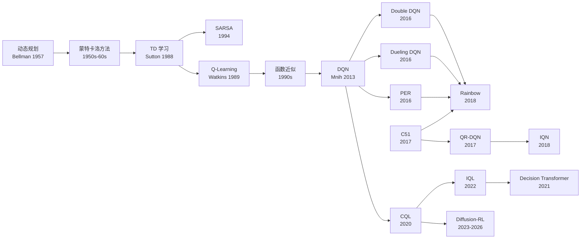

---
tags:
  - value-based
  - survey
  - history
  - evolution
created: 2026-06-21
---

# Value-Based 强化学习演化史

> 从 Bellman 方程到 Decision Transformer：一条以 **"更准确地估计价值"** 为主线的技术演化链。
> 每一个新方法的诞生，都是因为前一个方法在某个具体问题上失败了。

---

## 演化全景图

<!-- mmd-zoom:d1 -->
> 🔍 [缩放查看本图（可平移/缩放）](Value-Based演化史.md.mermaid.html#d1)

---

## Dynamic Programming (动态规划)

### 来源与动机
1950 年代，Richard Bellman 在研究多阶段决策过程时，发现了一个根本性的问题：**如何在一系列相互关联的决策中找到全局最优策略？** 传统的穷举法在状态数增长时完全不可行（组合爆炸）。Bellman 提出了"最优性原理"——一个最优策略的子策略也必须是最优的——从而将一个巨大的全局问题分解为可递推求解的局部子问题。

### 核心创新
动态规划（DP）通过 **Bellman 方程** 将价值函数的计算变成了一个递归的自举（bootstrapping）过程。它包含两种核心操作：**值迭代**（Value Iteration，直接迭代 Bellman 最优方程）和 **策略迭代**（Policy Iteration，交替进行策略评估和策略改进）。DP 的假设非常强：需要完整的环境模型（状态转移概率 $P(s'|s,a)$ 和奖励函数 $R(s,a)$ 完全已知）。

### 关键公式
Bellman 最优方程——所有 value-based RL 的"宪法"：
$$
V^*(s) = \max_a \sum_{s'} P(s'|s,a) \big[ R(s,a,s') + \gamma V^*(s') \big]
$$

### 优缺点
- ✅ 理论完备，保证收敛到最优策略
- ✅ 提供了 value-based 方法的数学基础和递归结构
- ❌ 需要完整的环境模型（model-based），现实中几乎不可能获得
- ❌ 计算复杂度 $O(|S|^2 |A|)$，状态空间大时不可行（维度灾难）

### 演化位置
**无** → **Dynamic Programming** → Monte Carlo / TD Learning
DP 是 value-based RL 的理论源头。它定义了"价值函数"这个核心概念，但因为它要求环境模型完全已知，后续方法的核心任务就是：**如何在不知道环境模型的情况下，仅通过与环境交互来近似 Bellman 方程的解。**

---

## Monte Carlo Methods (蒙特卡洛方法)

### 来源与动机
DP 需要环境模型，但很多真实问题中我们不知道转移概率。1950-60 年代，随着计算机模拟的兴起，研究者想到：**能不能不依赖模型，直接通过"跑一遍完整的游戏"来获得价值估计？** 这就是蒙特卡洛方法——用经验回报的均值来代替期望。

### 核心创新
蒙特卡洛（MC）方法通过 **采样完整的 episode**（从开始到终止），计算实际获得的累积回报 $G_t$，然后取其均值作为价值函数的估计。它完全不使用自举（bootstrapping），而是依赖真实回报。这使得它不需要环境模型，但也要求每个 episode 必须终止。

### 关键公式
$$
V(s) \leftarrow V(s) + \alpha \big[ G_t - V(s) \big]
$$
其中 $G_t = R_{t+1} + \gamma R_{t+2} + \gamma^2 R_{t+3} + \cdots$ 是从 $t$ 时刻到 episode 结束的折扣累积回报。

### 优缺点
- ✅ 不需要环境模型（model-free）
- ✅ 无自举偏差（bias），因为用的是真实回报
- ❌ 必须等到 episode 结束才能更新（sample efficiency 低）
- ❌ 高方差（variance），因为整条轨迹的随机性全部注入一个 $G_t$
- ❌ 无法处理持续性任务（无终止状态的问题）

### 演化位置
Dynamic Programming → **Monte Carlo** → TD Learning
MC 解决了"不需要模型"的问题，但引入了高方差和必须等待 episode 结束的限制。TD Learning 就是在这两个痛点上突破的：能不能不等到结束就更新？能不能降低方差？

---

## TD Learning (时序差分学习)

### 来源与动机
1988 年，Richard Sutton 发表了具有里程碑意义的论文 *"Learning to Predict by the Methods of Temporal Differences"*。他观察到：MC 方法必须等到 episode 结束才能获得反馈，而 DP 可以在每一步都更新（自举），但需要模型。**能不能结合两者的优点——既能像 DP 一样每步更新（自举），又能像 MC 一样不需要模型？**

### 核心创新
TD 学习的核心思想是：**用当前估计去更新当前估计**（bootstrapping without a model）。具体来说，它不等到 episode 结束获取 $G_t$，而是用 $R_{t+1} + \gamma V(S_{t+1})$ 作为目标——只看一步的即时奖励加上对下一步的价值估计。这就是 TD(0)。Sutton 还引入了 $\lambda$ 参数来平衡一步更新（TD(0)）和完整回报（MC）之间的连续谱，即 TD($\lambda$)。

### 关键公式
TD(0) 更新规则：
$$
V(S_t) \leftarrow V(S_t) + \alpha \big[ R_{t+1} + \gamma V(S_{t+1}) - V(S_t) \big]
$$
方括号内的量 $\delta_t = R_{t+1} + \gamma V(S_{t+1}) - V(S_t)$ 就是 **TD 误差**——整个 value-based RL 中最核心的信号。

### 优缺点
- ✅ 不需要环境模型（model-free，继承自 MC）
- ✅ 每一步都可以更新（不需要等 episode 结束，继承自 DP）
- ✅ 比 MC 方差更低（因为只看一步随机性，而不是整条轨迹）
- ✅ 可以处理持续性任务（不需要终止状态）
- ❌ 引入了自举偏差（bootstrap bias），因为用估计值更新估计值
- ❌ TD($\lambda$) 的 $\lambda$ 选择需要调参

### 演化位置
Monte Carlo / DP → **TD Learning** → SARSA / Q-Learning
TD 学习统一了 DP 的自举思想和 MC 的无模型特性。但它只是策略评估（prediction）方法。要用于控制（control），需要加上动作选择机制——这就引出了 SARSA（on-policy）和 Q-Learning（off-policy）两条路线。

---

## SARSA (State-Action-Reward-State-Action)

### 来源与动机
1994 年，Rummery 和 Niranjan 提出了 SARSA 算法（名称由 Sutton 后来命名）。TD 学习只评估一个策略的好坏（prediction），但在控制问题中，我们需要 **根据评估结果来改进策略**。最自然的做法就是：**用 TD 来评估当前正在执行的策略，然后根据 Q 值选择动作。** 这就是 SARSA——一种 on-policy TD 控制方法。

### 核心创新
SARSA 的核心是：**学习当前策略（behavior policy = target policy）的动作价值函数 $Q(s,a)$，然后用它来指导动作选择。** 更新时使用的是下一个状态-动作对 $(S_{t+1}, A_{t+1})$ 的 Q 值——而这个 $A_{t+1}$ 是当前策略实际会选择（或已经选择）的动作。这使得 SARSA 天然考虑了探索带来的风险。

### 关键公式
$$
Q(S_t, A_t) \leftarrow Q(S_t, A_t) + \alpha \big[ R_{t+1} + \gamma Q(S_{t+1}, A_{t+1}) - Q(S_t, A_t) \big]
$$
注意 $A_{t+1}$ 是当前策略（如 $\epsilon$-greedy）实际选择的动作。

### 优缺点
- ✅ on-policy：学到的是当前执行策略的价值，更安全（考虑探索风险）
- ✅ 在有随机性的环境中比 Q-Learning 更保守、更安全
- ❌ on-policy 意味着数据利用率低——只有当前策略产生的数据才能用
- ❌ 探索噪声（如 $\epsilon$-greedy）会影响学到的策略质量
- ❌ 收敛速度通常比 off-policy 方法慢

### 演化位置
TD Learning → **SARSA** → (on-policy 路线：SARSA($\lambda$) 等)
SARSA 代表了 on-policy TD 控制这条路线。但它的 on-policy 特性导致数据效率不高。Q-Learning 走了另一条路：off-policy——可以从任何策略收集的数据中学习最优策略。

---

## Q-Learning

### 来源与动机
1989 年，Chris Watkins 在其博士论文中提出了 Q-Learning（1992 年与 Dayan 合作发表收敛性证明）。SARSA 的 on-policy 特性意味着：**你只能通过当前策略自己产生的数据来学习。** 但 Watkins 想到：**能不能不管数据是怎么来的（任何策略产生的），都用来学习最优策略？** 这就是 off-policy 学习的核心思想。

### 核心创新
Q-Learning 的核心创新是 **off-policy + max 操作**：更新目标中取下一个状态所有动作中 Q 值最大的那个，而不管下一个动作实际上是什么。这意味着 Q-Learning 直接学习最优策略的 Q 函数，即使行为策略（behavior policy，比如 $\epsilon$-greedy）在不断探索。行为策略和目标策略是分离的。

### 关键公式
$$
Q(S_t, A_t) \leftarrow Q(S_t, A_t) + \alpha \big[ R_{t+1} + \gamma \max_{a'} Q(S_{t+1}, a') - Q(S_t, A_t) \big]
$$
与 SARSA 的关键区别在于 $\max_{a'}$：它不关心 $A_{t+1}$ 是什么，而是取所有可能动作中的最大值。

### 优缺点
- ✅ off-policy：可以从任意策略收集的数据中学习最优策略
- ✅ 数据利用率高——旧数据、其他策略的数据都能用
- ✅ 在 tabular 情形下有收敛到最优策略的证明（Watkins & Dayan, 1992）
- ❌ max 操作导致 **最大化偏差（maximization bias）**——系统性地高估 Q 值
- ❌ 与函数近似结合时，收敛性不再保证（Tsitsiklis & Van Roy, 1997 反例）
- ❌ 表格方法无法处理大规模状态空间

### 演化位置
TD Learning → **Q-Learning** → Function Approximation → DQN
Q-Learning 的 off-policy 思想是革命性的，但 tabular Q-Learning 面对大规模问题时束手无策。下一个关键问题：**如何用函数近似（神经网络）来扩展 Q-Learning？**

---

## Function Approximation (函数近似)

### 来源与动机
1990 年代，随着强化学习从小玩具问题走向更大的应用，tabular 方法（Q-table）遇到了根本障碍：**状态空间太大甚至连续时，Q 表存不下、学不动。** 比如一个 $10 \times 10$ 的网格有 100 个状态还好，但 Atari 游戏的画面是 $210 \times 160$ 的像素——状态空间是 $256^{33600}$，根本不可能用表格存储。

### 核心创新
函数近似的思想：**用一个参数化函数 $\hat{Q}(s, a; \theta)$ 来近似真实的 Q 函数**，参数 $\theta$ 的数量远小于状态数。从线性函数（手工特征 + 线性权重）到非线性函数（神经网络），这条路线逐步发展。关键转变是：不再为每个 $(s,a)$ 单独维护一个值，而是让参数 $\theta$ 在相似状态之间 **泛化**。

### 关键公式
$$
\hat{Q}(s, a; \theta) \approx Q^*(s, a)
$$
损失函数：
$$
L(\theta) = \mathbb{E}_{(s,a,r,s') \sim \mathcal{D}} \big[ \big( r + \gamma \max_{a'} \hat{Q}(s', a'; \theta) - \hat{Q}(s, a; \theta) \big)^2 \big]
$$

### 优缺点
- ✅ 能处理大规模甚至连续状态空间
- ✅ 相似状态之间可以泛化（transfer）
- ❌ 与 Q-Learning 的 off-policy 特性结合时，训练极不稳定（发散问题）
- ❌ 线性近似需要人工设计特征（feature engineering）
- ❌ 非线性近似（神经网络）引入了非平稳性、相关数据、目标漂移等问题

### 演化位置
Q-Learning → **Function Approximation** → DQN
线性函数近似在 1990-2000 年代有许多成功案例（如 TD-Gammon），但非线性近似一直不稳定。直到 2013 年 DQN 用两个关键技术（经验回放 + 目标网络）才真正解决了这个问题。

---

## DQN (Deep Q-Network)

### 来源与动机
2013 年（NIPS Workshop），2015 年（Nature 正式版），DeepMind 的 Volodymyr Mnih 等人发表了 DQN。背景：将 Q-Learning 与神经网络结合的尝试已有多年，但 **训练极度不稳定、经常发散**。核心困难有三：(1) 数据高度时序相关（相邻帧几乎一样）；(2) 学习目标和当前网络使用相同参数（"追逐自己的尾巴"）；(3) 奖励尺度差异巨大。

### 核心创新
DQN 引入两个关键技术：
1. **经验回放（Experience Replay）**：将交互数据存储到回放缓冲区，训练时随机采样 mini-batch。打破数据之间的时序相关性。
2. **目标网络（Target Network）**：使用一个独立且定期更新的网络 $Q_{\theta^-}$ 来计算 TD 目标，稳定学习目标。

这两个技术加上 Q-Learning 的 off-policy 框架，第一次让深度神经网络在 Atari 游戏上达到了人类水平的表现。

### 关键公式
$$
L(\theta) = \mathbb{E}_{(s,a,r,s') \sim U(\mathcal{D})} \big[ \big( r + \gamma \max_{a'} Q(s', a'; \theta^-) - Q(s, a; \theta) \big)^2 \big]
$$
其中 $\theta^-$ 是目标网络参数，$U(\mathcal{D})$ 是均匀采样。

### 优缺点
- ✅ 第一次在大规模视觉任务上实现端到端学习
- ✅ 经验回放 + 目标网络解决了稳定性问题
- ✅ 单一架构 + 单一超参数在 49 个 Atari 游戏上表现良好
- ❌ 仍然存在 Q 值高估问题（max 操作导致）
- ❌ 无法处理多模态动作空间（只输出离散动作的 Q 值）
- ❌ 样本效率仍然不高（需要数千万帧训练）
- ❌ 不同游戏表现差异大（某些游戏远低于人类）

### 演化位置
Function Approximation → **DQN** → Double DQN / Dueling DQN / PER / C51 → Rainbow
DQN 开启了深度强化学习时代。但它存在的高估、方差、效率等问题催生了一系列改进——最终在 Rainbow 中被统一。

---

## Double DQN (DDQN)

### 来源与动机
2016 年（AAAI），Hado van Hasselt、Arthur Guez 和 David Silver 发表。他们发现：**DQN 在 Atari 某些游戏中存在严重的 Q 值高估问题。** 高估的根源是 Q-Learning 中的 $\max$ 操作——如果 Q 网络对某些动作的值有正向估计误差，$\max$ 会系统性地选中这些被高估的动作，导致"乐观偏差"不断累积。

### 核心创新
Double DQN 的核心思想来自 Double Q-Learning（van Hasselt, 2010）：**将"选择动作"和"评估动作"解耦。** 用当前网络 $Q_\theta$ 选择最优动作（argmax），用目标网络 $Q_{\theta^-}$ 评估该动作的价值。两个独立网络不太可能同时高估同一个动作，从而大幅减少高估偏差。

### 关键公式
$$
y = r + \gamma Q_{\theta^-}\big(s', \arg\max_{a'} Q_\theta(s', a')\big)
$$
对比 DQN 的目标 $y = r + \gamma \max_{a'} Q_{\theta^-}(s', a')$，关键区别是 $\arg\max$ 和 $Q$ 来自不同网络。

### 优缺点
- ✅ 大幅减少 Q 值高估，在多个 Atari 游戏上性能显著提升
- ✅ 实现极其简单——只需改动一行代码
- ✅ 通用技术，可以和任何 DQN 变体结合
- ❌ 只是缓解高估，不能完全消除（如果两个网络都高估，仍有残余偏差）
- ❌ 在某些高估不严重的问题上改进不大

### 演化位置
DQN → **Double DQN** → Rainbow
Double DQN 是 DQN 家族第一个被证明有效且广泛使用的改进。它和后续的 Dueling DQN、PER 一起成为 Rainbow 的核心组件。

---

## Dueling DQN

### 来源与动机
2016 年（ICML），Ziyu Wang、Tom Schaul 等人提出。他们观察到：**在很多状态下，不同动作的价值差异很小，但状态本身的价值（"这个状态好不好"）非常重要。** 例如在驾驶场景中，"前方是直路"这个状态的价值很高，而"左转/右转/直行"各动作的相对优势差异不大。传统 DQN 将 $V(s)$ 和 $A(s,a)$ 混在一起学，无法充分利用这种结构。

### 核心创新
Dueling 网络架构将 Q 值分解为两个独立的估计器：
- **状态价值 $V(s)$**："这个状态有多好？"（与动作无关）
- **优势函数 $A(s,a)$**："在这个状态下，选这个动作比其他动作好多少？"

$Q(s,a) = V(s) + A(s,a)$。通过共享底层特征提取网络，两个分支可以独立学习。在"动作选择不太重要"的状态下，$V(s)$ 可以更准确地被估计。

### 关键公式
$$
Q(s, a; \theta, \alpha, \beta) = V(s; \theta, \beta) + \bigg( A(s, a; \theta, \alpha) - \frac{1}{|A|} \sum_{a'} A(s, a'; \theta, \alpha) \bigg)
$$
减去均值是为了保证可识别性（identifiability），否则 $V$ 和 $A$ 有无穷多解。

### 优缺点
- ✅ 在动作选择影响不大的状态中，策略评估更准确
- ✅ 不改变 RL 算法本身，纯粹是网络结构的改进
- ✅ 可以和 Double DQN、PER 等无缝结合
- ❌ 在动作选择非常关键的场景中优势不明显
- ❌ 增加了网络参数量

### 演化位置
DQN → **Dueling DQN** → Rainbow
Dueling 提供了更好的价值函数表示能力，成为 Rainbow 的关键组件之一。

---

## Prioritized Experience Replay (PER)

### 来源与动机
2016 年（ICLR），Tom Schaul、John Quan 等人提出。标准 DQN 的经验回放是 **均匀采样**——每条经验被选中的概率相同。但显然，不同经验的"学习价值"天差地别：**一条让你"恍然大悟"的经验（TD 误差大）比一条"毫无新意"的经验（TD 误差小）更值得反复学习。**

### 核心创新
PER 根据 **TD 误差的绝对值** 来给每条经验分配采样优先级。TD 误差越大，说明当前网络对这条经验的预测越差，越需要被重新学习。为了修正非均匀采样引入的偏差，PER 使用 **重要性采样权重（importance sampling weights）** 来缩放梯度更新。

### 关键公式
采样概率：
$$
P(i) = \frac{p_i^\alpha}{\sum_k p_k^\alpha}
$$
其中 $p_i = |\delta_i| + \epsilon$（基于 TD 误差的优先级），$\alpha$ 控制优先级化的程度。
重要性采样权重：
$$
w_i = \bigg( \frac{1}{N \cdot P(i)} \bigg)^\beta
$$

### 优缺点
- ✅ 大幅提升学习效率，在 41/49 个 Atari 游戏上超越均匀采样 DQN
- ✅ 通用技术，可以和任何基于经验回放的方法结合
- ❌ 需要维护优先级数据结构（如 SumTree），增加实现复杂度
- ❌ 超参数 $\alpha$ 和 $\beta$ 需要调节
- ❌ 对噪声敏感——偶然的异常 TD 误差可能导致过度采样

### 演化位置
DQN → **PER** → Rainbow
PER 改进了经验回放的效率，成为 Rainbow 中贡献最大的单个组件（消融实验表明）。

---

## C51 (Categorical DQN / Distributional RL)

### 来源与动机
2017 年（ICML），Marc Bellemare、Will Dabney 和 Remi Munos 发表了 *"A Distributional Perspective on Reinforcement Learning"*。传统 RL 只学习 **期望回报** $V(s) = \mathbb{E}[G_t | S_t = s]$，即一个标量。但实际回报是一个 **随机变量**——同一个状态可能得到很高的回报，也可能得到很低的回报。只学均值会丢失这个分布信息。

### 核心创新
C51 的核心思想：**不再只学回报的期望，而是学习回报的完整概率分布。** 具体来说，它将回报分布近似为一个支撑在 51 个等距原子（atoms）上的离散分布（因此叫 C51），然后用投影操作（categorical projection）来实现分布版本的 Bellman 更新。这不仅提供了更丰富的信息（可以衡量风险），而且在 Atari 基准上取得了 state-of-the-art。

### 关键公式
分布 Bellman 方程：
$$
Z(s, a) \stackrel{D}{=} R(s, a) + \gamma Z(S', A')
$$
其中 $Z$ 是回报的随机变量（不是期望），$\stackrel{D}{=}$ 表示分布意义上的等式。

### 优缺点
- ✅ 保留了回报的分布信息（可以衡量风险和不确定性）
- ✅ 在 Atari 上性能显著优于 DQN 和 Double DQN
- ✅ 理论上证明了分布 Bellman 算子在策略评估中的收敛性
- ❌ 51 个原子的支撑点是固定的，不能自适应分布形状
- ❌ 投影操作引入了近似误差
- ❌ 实现比 DQN 复杂

### 演化位置
DQN → **C51** → QR-DQN → IQN → Rainbow
C51 开启了分布式 RL（Distributional RL）这一新方向，后续的 QR-DQN 和 IQN 改进了其分布表示方法。

---

## QR-DQN (Quantile Regression DQN)

### 来源与动机
2017 年（AAAI 2018），Will Dabney 等人提出。C51 的问题在于它固定了 51 个支撑点的位置，只学习每个位置的概率质量。但如果真实回报分布的形状和这些固定点不匹配，近似质量就会差。**能不能让支撑点的位置自适应？**

### 核心创新
QR-DQN 反转了思路：不固定位置学概率，而是 **固定概率学分位数（quantile）的位置**。具体来说，它将回报分布用 $N$ 个等概率的分位数来表示，每个分位数的位置（值）是可学习的。通过分位数回归损失（quantile regression loss，即 pinball loss）来训练，避免了 C51 的投影操作。

### 关键公式
分位数回归损失：
$$
\rho_\tau^\kappa(\delta) = |\tau - \mathbb{1}[\delta < 0]| \cdot \frac{|\delta|}{\kappa}
$$
其中 $\tau$ 是分位数位置（如 0.1, 0.5, 0.9），$\delta = \theta_j^{\text{target}} - \theta_i$ 是 TD 误差。

### 优缺点
- ✅ 分位数位置自适应，比 C51 更灵活
- ✅ 不需要投影操作，实现更简单
- ✅ 在 Atari 上显著超越 C51
- ❌ 分位数数量 $N$ 仍然是固定的超参数
- ❌ 不能动态调整分布的分辨率

### 演化位置
C51 → **QR-DQN** → IQN → Rainbow
QR-DQN 改进了 C51 的分布表示方式，IQN 进一步让它完全自适应。

---

## IQN (Implicit Quantile Networks)

### 来源与动机
2018 年（ICML），Will Dabney 等人提出。C51 和 QR-DQN 都用固定数量的参数来表示回报分布（51 个原子或 $N$ 个分位数）。**能不能用一个网络来表示整个分位数函数（quantile function），从而以任意精度表示任意分布？**

### 核心创新
IQN 用一个神经网络直接输出 **分位数函数 $\tau \mapsto Z_\tau$**，其中 $\tau \in [0,1]$ 是连续的分位数位置。网络接收一个随机采样的 $\tau$ 值（通过余弦嵌入），输出对应分位数的值。这样，分布的分辨率不再受限于固定数量的参数——推理时可以采样任意多个 $\tau$ 来重建分布。

### 关键公式
$$
Z_\tau(s, a) = f\big(\phi(\tau) \odot \psi(s)\big)_a
$$
其中 $\phi(\tau) = (\cos(\pi i \tau))_{i=0}^{n-1}$ 是 $\tau$ 的余弦嵌入，$\psi(s)$ 是状态特征，$f$ 是全连接层。

### 优缺点
- ✅ 分位数函数连续且自适应——可以表示任意形状的分布
- ✅ 推理时可以通过增加采样数来提高分布精度
- ✅ 支持风险敏感策略（risk-sensitive policies）
- ✅ 在 Atari 上达到当时的 state-of-the-art
- ❌ 训练和推理时需要采样 $\tau$，引入了额外的随机性
- ❌ 比 DQN 计算开销更大

### 演化位置
QR-DQN → **IQN** → Rainbow
IQN 是分布式 RL 路线的成熟形态，被纳入 Rainbow。

---

## Rainbow

### 来源与动机
2018 年（AAAI），Matteo Hessel 等人（DeepMind）发表。到 2017 年，DQN 已经有了多个独立改进：Double DQN、Dueling DQN、PER、Multi-step 目标、Distributional RL（C51）、Noisy Networks。但这些改进是 **独立提出的**，没人知道它们之间是否互补、是否可以叠加、以及哪些贡献最大。

### 核心创新
Rainbow 将六个 DQN 改进整合到一个统一的智能体中：
1. **Double DQN**（减少高估）
2. **Dueling DQN**（更好的价值表示）
3. **Prioritized Experience Replay**（高效数据利用）
4. **Multi-step 目标**（平衡偏差和方差，n-step returns）
5. **Distributional RL**（C51 分布视角）
6. **Noisy Networks**（参数噪声探索，替代 $\epsilon$-greedy）

消融实验表明，每个组件都有正向贡献，其中 PER 和 Distributional RL 贡献最大。Rainbow 在 Atari 基准上达到了人类归一化得分中位数 223%（DQN 为 79%）。

### 关键公式
Rainbow 的 TD 目标（综合了 n-step + distributional + double）：
$$
Z_t = \sum_{k=0}^{n-1} \gamma^{(k)} R_{t+k+1} + \gamma^{(n)} Z\big(S_{t+n}, \arg\max_a Q(S_{t+n}, a)\big)
$$
其中 $Z$ 是分布返回值（categorical），$\arg\max$ 用在线网络选动作、目标网络评价值（Double）。

### 优缺点
- ✅ 在 Atari 基准上达到当时的最佳性能（中位数人类得分 223%）
- ✅ 证明了各组件之间是互补的
- ✅ 消融实验清晰展示了每个组件的贡献
- ❌ 实现极其复杂（需要同时集成六个模块）
- ❌ 超参数数量多，调参成本高
- ❌ 在某些特定任务上，单个改进可能已经足够

### 演化位置
Double DQN + Dueling DQN + PER + C51 + NoisyNet + n-step → **Rainbow** → (DQN 路线的集大成者)
Rainbow 代表了 value-based deep RL 的"工程巅峰"。但 DQN 路线本身仍面临一个根本问题：**在线 RL 需要大量交互数据。** 能不能从固定数据集中学习？

---

## CQL (Conservative Q-Learning)

### 来源与动机
2020 年（NeurIPS），Aviral Kumar、Aurick Zhou、George Tucker、Sergey Levine 提出。在真实应用中（医疗、自动驾驶、推荐系统），**和环境交互的代价极高甚至不可能**。Offline RL 的目标是从静态数据集中学习策略，但标准 off-policy RL（如 DQN、SAC）在 offline 设置下会灾难性失败：**策略会倾向于选择数据集中没见过的动作（OOD actions），而 Q 函数对这些动作的值会严重高估，导致学到的策略在实际执行时表现很差。**

### 核心创新
CQL 的核心思想极其简洁：**在标准 Bellman 误差上加一个正则化项，使得 Q 函数对当前策略倾向的动作给出保守（低）的估值，同时对数据集中的动作保持准确估值。** 这样，策略在优化时不会"盲目乐观"地选择数据集中不存在但被高估的动作。CQL 证明了它学到的 Q 值是当前策略真实价值的下界。

### 关键公式
$$
\min_\theta \; \alpha \cdot \Big( \mathbb{E}_{s \sim \mathcal{D}} \big[ \log \sum_a \exp Q_\theta(s,a) \big] - \mathbb{E}_{s,a \sim \mathcal{D}} \big[ Q_\theta(s,a) \big] \Big) + \frac{1}{2} \mathbb{E}_{s,a,r,s' \sim \mathcal{D}} \big[ (Q_\theta(s,a) - \hat{\mathcal{B}}^\pi \hat{Q}(s,a))^2 \big]
$$
第一项是正则化（压缩 OOD 动作的 Q 值），第二项是标准 Bellman 误差。

### 优缺点
- ✅ 理论保证：学到的 Q 值是策略真实价值的下界
- ✅ 实现简单——在现有 DQN/SAC 上只加一行正则化
- ✅ 在 D4RL 基准上大幅超越之前的 offline RL 方法
- ❌ 过于保守——可能错过数据集中确实存在的好策略
- ❌ 超参数 $\alpha$（保守度）敏感，不同任务需要不同设置
- ❌ 仍需在训练中查询 OOD 动作的 Q 值（正则化项需要 $\log \sum_a \exp Q$）

### 演化位置
DQN/SAC offline → **CQL** → IQL / Decision Transformer
CQL 是 offline value-based RL 的开创性工作。它虽然保守，但提出了一个核心问题：**如何在不查询 OOD 动作的情况下改进策略？** IQL 直接回答了这个挑战。

---

## IQL (Implicit Q-Learning)

### 来源与动机
2022 年（ICLR），Ilya Kostrikov、Ashvin Nair、Sergey Levine 提出。CQL 虽然有效，但它在训练过程中仍然需要 **查询 OOD 动作的 Q 值**（通过 $\log \sum_a \exp Q$ 项）。这带来了两个问题：(1) 需要计算所有动作的 Q 值或做近似，计算成本高；(2) OOD 查询本身就可能引入估计误差。IQL 的核心洞察：**能不能完全避免查询数据集中不存在的动作，但仍然实现策略改进？**

### 核心创新
IQL 的核心思想：**用 expectile 回归来"隐式地"近似策略改进步骤，而不需要显式地查询任何 OOD 动作。** 具体来说，IQL 将状态价值 $V(s)$ 视为一个随机变量（随机性来自动作 $a$），然后取 $V(s)$ 的 **上 expectile**（类似于分位数但用非对称平方损失）。这个上 expectile 近似了 $\max_a Q(s,a)$ 但只用数据集中存在的动作来计算——完全不需要查询任何未见过的动作。策略提取则用 advantage-weighted regression（AWR）。

### 关键公式
Expectile 回归（学习 $V(s)$）：
$$
L_V(\psi) = \mathbb{E}_{(s,a) \sim \mathcal{D}} \big[ | \tau - \mathbb{1}[Q_\theta(s,a) - V_\psi(s) < 0] | \cdot (Q_\theta(s,a) - V_\psi(s))^2 \big]
$$
其中 $\tau \in (0.5, 1]$ 控制 expectile 的位置（$\tau \to 1$ 趋近于 max）。
Q 函数更新使用 $V(s)$ 而非 $\max_a Q(s',a)$：
$$
L_Q(\theta) = \mathbb{E}_{(s,a,r,s') \sim \mathcal{D}} \big[ (r + \gamma V_\psi(s') - Q_\theta(s,a))^2 \big]
$$

### 优缺点
- ✅ 完全避免 OOD 查询——训练过程中从不评估数据集中不存在的动作
- ✅ 在 D4RL 基准上达到 state-of-the-art，尤其在 AntMaze 等困难任务上
- ✅ 支持 offline-to-online 微调（finetuning 效果好）
- ✅ 实现简洁（expectile 回归 + AWR）
- ❌ expectile 超参数 $\tau$ 需要调节
- ❌ AWR 策略提取可能不如基于 Q 值最大化的方法高效
- ❌ 对数据质量和覆盖度有较高要求

### 演化位置
CQL → **IQL** → Decision Transformer / Diffusion-RL
IQL 代表了 value-based offline RL 的成熟形态。但它仍依赖 Q 函数。Decision Transformer 则完全抛弃了 Q 函数，将 RL 重新定义为序列建模问题。

---

## Decision Transformer

### 来源与动机
2021 年（NeurIPS），Lili Chen、Kevin Lu 等人提出（Google Brain）。传统 offline RL 方法（CQL、IQL）都基于 **动态规划 / Bellman 方程** 的框架——通过估计 Q 值或 V 值来改进策略。但这种方式在面对复杂、多模态的行为数据时，仍然面临各种稳定性问题。与此同时，**Transformer 架构在 NLP 和 CV 领域取得了巨大成功**——能不能把 RL 也变成序列建模问题？

### 核心创新
Decision Transformer 的核心思想：**将 RL 重新定义为条件序列建模（conditional sequence modeling）。** 不是估计 Q 值或策略梯度，而是训练一个 Transformer，输入"期望达到的回报 $R^*$"、"历史状态序列"和"历史动作序列"，直接自回归地输出下一步动作。本质上就是：**"给我一个目标回报，我直接生成能达成这个回报的动作序列。"** 这完全绕开了 Bellman 方程和值函数。

### 关键公式
模型条件化序列：
$$
\tau = \hat{R}_1, s_1, a_1, \hat{R}_2, s_2, a_2, \ldots, \hat{R}_T, s_T, a_T
$$
其中 $\hat{R}_t = \sum_{t'=t}^T r_{t'}$ 是从时刻 $t$ 到结束的回报（return-to-go）。模型预测：
$$
p_\theta(a_t | \hat{R}_t, s_t, \text{history}) = \text{Transformer}(\hat{R}_t, s_t, \ldots)
$$

### 优缺点
- ✅ 完全绕开 Bellman 方程，训练像语言模型一样稳定
- ✅ 可以利用大规模预训练 Transformer 的架构和训练技巧
- ✅ 通过指定不同的目标回报，可以实现不同水平的策略
- ✅ 在 Atari、OpenAI Gym 等基准上与 CQL/IQL 相当或更好
- ❌ 本质上是行为克隆的变体——不会发现数据集中没有的策略
- ❌ 对目标回报 $\hat{R}$ 的设定敏感（推理时需要知道好的回报是多少）
- ❌ 在需要长程规划和探索的任务上表现不佳
- ❌ 缺乏理论上的策略改进保证

### 演化位置
IQL / CQL → **Decision Transformer** → Gato / RT-2 / Diffusion Policies
Decision Transformer 代表了 value-based RL 的一次"范式跳跃"：不再学 Q 值，而是直接学策略。后续工作（如 Gato、RT-2）将这种思想扩展到多任务和大规模预训练。

---

## Diffusion-RL (2023-2026 前沿)

### 来源与动机
2023-2026 年，offline RL 领域出现了一个重要趋势：**用扩散模型（Diffusion Models）来表示策略或 Q 函数。** 代表工作包括 Diffuser (Janner et al., 2022)、Diffusion Policy (Chi et al., 2023)、以及最近的 **Reversal Q-Learning** (Oberai, Park & Levine, 2026) 和 **Bootstrapped Flow Q-Learning** (ICML 2026)。CQL 和 IQL 的策略提取步骤通常假设高斯或确定性策略，但真实世界中的专家行为往往是 **多模态的**（同一个状态可能有多种合理动作）。扩散模型恰好擅长建模复杂、多模态的分布。

### 核心创新
**Diffusion Policy + Q-Learning 的结合**：
- **Diffuser** (2022)：用扩散模型直接生成轨迹（state-action 序列），将 RL 规划变成条件去噪过程
- **Reversal Q-Learning (RQL)** (2026)：将 flow matching 与 off-policy Q-learning 结合，通过"反转" flow 来生成虚拟 on-policy 轨迹，解决了 flow-based RL 的训练效率问题
- **Bootstrapped Flow Q-Learning (BFQ)** (ICML 2026)：将多步去噪简化为单步生成，大幅提升训练和推理速度，在 D4RL 上超越多步扩散基线

### 关键公式（Reversal Q-Learning）
在扩展 MDP 框架中，将 flow 的每一步去噪视为一个 action：
$$
Q(s, a_{\text{flow}}) = \mathbb{E}\big[ R + \gamma V(s') \big]
$$
通过"反转" flow 过程生成虚拟 on-policy 轨迹来兼容离线数据。

### 优缺点
- ✅ 能建模高度多模态的策略分布
- ✅ 在复杂机器人操作任务上表现优异
- ❌ 训练和推理计算成本高（多步去噪）
- ❌ 与 value-based 方法的结合仍处于探索阶段
- ❌ 理论保证不如 CQL/IQL 成熟

### 演化位置
IQL / CQL → **Diffusion-RL** → (活跃研究前沿，2024-2026)
这是 value-based RL 与生成模型交叉的最新前沿。

---

## 演化总结：核心矛盾的演进

| 时代 | 核心矛盾 | 代表方法 |
|------|---------|---------|
| 1950s-60s | 需要环境模型 vs 现实中不可得 | DP → MC |
| 1988-94 | 每步更新 vs 等 episode 结束 | TD → SARSA/Q-Learning |
| 1989-2000s | on-policy 安全 vs off-policy 高效 | SARSA vs Q-Learning |
| 1990s-2013 | 表格不可扩展 vs 真实世界大状态空间 | FA → DQN |
| 2015-18 | 训练不稳定 / 高估 / 低效 | DQN → Rainbow |
| 2017-18 | 只学期望 vs 学习分布 | DQN → C51/QR-DQN/IQN |
| 2020-22 | 在线交互代价高 vs 离线数据利用 | DQN → CQL → IQL |
| 2021- | Bellman 框架 vs 序列建模 | CQL/IQL → Decision Transformer |
| 2023-26 | 单模态策略 vs 多模态行为 | IQL → Diffusion-RL |

---

## 关键论文索引

| 方法 | 论文 | 作者 | 年份 | 会议 |
|------|------|------|------|------|
| DP | *Dynamic Programming* | Bellman | 1957 | (书) |
| TD | *Learning to Predict by the Methods of Temporal Differences* | Sutton | 1988 | Machine Learning |
| Q-Learning | *Learning from Delayed Rewards* | Watkins | 1989 | (博士论文) |
| Q-Learning 收敛 | *Q-learning* | Watkins & Dayan | 1992 | Machine Learning |
| SARSA | *On-line Q-learning using connectionist systems* | Rummery & Niranjan | 1994 | (技术报告) |
| DQN (NIPS) | *Playing Atari with Deep Reinforcement Learning* | Mnih et al. | 2013 | NIPS Workshop |
| DQN (Nature) | *Human-level control through deep RL* | Mnih et al. | 2015 | Nature |
| Double DQN | *Deep RL with Double Q-learning* | van Hasselt et al. | 2016 | AAAI |
| Dueling DQN | *Dueling Network Architectures for Deep RL* | Wang et al. | 2016 | ICML |
| PER | *Prioritized Experience Replay* | Schaul et al. | 2016 | ICLR |
| C51 | *A Distributional Perspective on RL* | Bellemare et al. | 2017 | ICML |
| QR-DQN | *Distributional RL with Quantile Regression* | Dabney et al. | 2018 | AAAI |
| IQN | *Implicit Quantile Networks for Distributional RL* | Dabney et al. | 2018 | ICML |
| Rainbow | *Rainbow: Combining Improvements in Deep RL* | Hessel et al. | 2018 | AAAI |
| CQL | *Conservative Q-Learning for Offline RL* | Kumar et al. | 2020 | NeurIPS |
| Decision Transformer | *Decision Transformer: RL via Sequence Modeling* | Chen et al. | 2021 | NeurIPS |
| IQL | *Offline RL with Implicit Q-Learning* | Kostrikov et al. | 2022 | ICLR |
| Reversal Q-Learning | *Reversal Q-Learning* | Oberai, Park & Levine | 2026 | (preprint) |
| BFQ | *Bootstrapped Flow Q-Learning* | Nguyen et al. | 2026 | ICML |

---

> **写在最后**：value-based RL 的演化史，本质上是一部 **"如何更准确地估计价值"** 的历史。从 Bellman 方程给出理论定义，到 MC 解决"不要模型"，到 TD 解决"每步更新"，到 Q-Learning 解决"off-policy"，到 DQN 解决"大规模"，到 Rainbow 解决"各种工程缺陷"，到 CQL/IQL 解决"离线数据"，到 Decision Transformer 彻底跳出 Bellman 框架——每一步都是因为上一步在某个具体问题上走到了极限。理解这条演化链，就是理解 value-based RL 为什么是今天这个样子。
